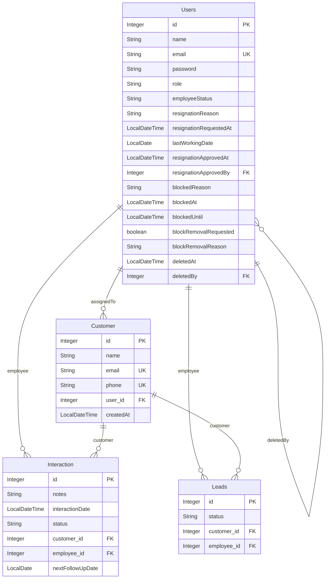

# Enterprise CRM System - Technical & Feature Documentation

This documentation provides an end-to-end technical reference of the **Enterprise Customer Relationship Management (CRM)** application. It covers architecture, entity schemas, data models, functional workflows, business invariants, and the complete REST API interface for reference.

---

## Table of Contents

1. [Project Overview](#1-project-overview)
2. [Data Model](#2-data-model)
3. [Feature Documentation](#3-feature-documentation)
4. [API Reference](#4-api-reference)
5. [Business Rules & Invariants](#5-business-rules--invariants)
6. [Security & Permissions Matrix](#6-security--permissions-matrix)
7. [Known Limitations & Future Improvements](#7-known-limitations--future-improvements)

---

## 1. Project Overview

The Enterprise CRM is a multi-user portal designed to coordinate client communication, lead management, and employee assignment. The system supports two user categories:

- **Administrators (Admin)**: Oversee employee status (blocking, onboarding, soft deletion, resignation reviews), monitor global conversion rates, view top performers, and manage/reassign customer ownership.
- **Employees (Employee)**: Manage assigned customers, log interactions, update pipeline lead statuses, and submit resignation or account unblock requests.

### Technical Stack

- **Java Version**: Java 21
- **Framework**: Spring Boot 3.x
- **Security Framework**: Spring Security (JWT-based Stateless Authentication)
- **Build Automation**: Maven
- **Database**: MySQL (5.7+ / 8.x)
- **Object-Relational Mapping (ORM)**: Hibernate / Spring Data JPA
- **Frontend**: React (Vite-powered, Tailwind CSS, Axios)

### High-Level Architecture Diagram

The application follows a standard layered architecture:

```
[React Frontend] (Axios)
      │
      ▼ (HTTP / JSON / JWT)
[Spring Security Filter Chain] (SecurityConfig / AuthTokenFilter)
      │
      ▼
[Controller Layer] (RestControllers mapping request endpoints)
      │
      ▼
[Service Layer] (Services & Implementations containing business logic)
      │
      ▼
[Repository Layer] (Spring Data JPA interfaces mapping databases)
      │
      ▼
[Database Entity Layer] (JPA Entities mapped to MySQL tables)
```

---

## 2. Data Model

### Entities

#### `Users`

Represents an authenticated user (Admin or Employee) in the system.

- **Fields**:
  - `id` (`Integer`, Primary Key, Generated Identity): Unique identifier.
  - `name` (`String`): Full name.
  - `email` (`String`, Unique): User email, used for login.
  - `password` (`String`, `@JsonIgnore`): BCrypt hashed password.
  - `role` (`Role`, Enum as String): `ADMIN` or `EMPLOYEE`.
  - `createdAt` (`LocalDateTime`, `@CreationTimestamp`, Updatable = false): Account registration timestamp.
  - `employeeStatus` (`EmployeeStatus`, Enum as String, Default = `ACTIVE`): Account state.
  - `resignationReason` (`String`, Nullable): Reason specified in resignation request.
  - `resignationRequestedAt` (`LocalDateTime`, Nullable): Resignation request timestamp.
  - `lastWorkingDate` (`LocalDate`, Nullable): Target last day of work.
  - `resignationApprovedAt` (`LocalDateTime`, Nullable): Resignation approval timestamp.
  - `resignationApprovedBy` (`Users`, ManyToOne): Admin who approved the resignation.
  - `blockedReason` (`String`, Nullable): Reason employee was blocked.
  - `blockedAt` (`LocalDateTime`, Nullable): Timestamp of block activation.
  - `blockedUntil` (`LocalDateTime`, Nullable): Expiry timestamp of the block.
  - `blockRemovalRequested` (`boolean`, Default = `false`): Flag requesting unblocking review.
  - `blockRemovalReason` (`String`, Nullable): Explanation sent by the blocked user.
  - `deletedAt` (`LocalDateTime`, Nullable): Timestamp of soft delete.
  - `deletedBy` (`Users`, ManyToOne): Admin who soft-deleted the user.

- **Relationships**:
  - `customers` (`@OneToMany`, mappedBy = "assignedTo"): One user can have many assigned customers. Cascade: None (orphan prevention handled in service layer).
  - `resignationApprovedBy` (`@ManyToOne`, JoinColumn = "resignation_approved_by"): Self-referencing link to the admin user.
  - `deletedBy` (`@ManyToOne`, JoinColumn = "deleted_by"): Self-referencing link to the admin user.

#### `Customer`

Represents a customer profile registered in the database.

- **Fields**:
  - `id` (`Integer`, Primary Key, Generated Identity): Unique identifier.
  - `name` (`String`, Nullable = false): Customer name.
  - `email` (`String`, Unique): Customer email.
  - `phone` (`String`, Unique, Nullable = false): Customer phone number.
  - `createdAt` (`LocalDateTime`, `@CreationTimestamp`, Updatable = false): Registration timestamp.

- **Relationships**:
  - `assignedTo` (`@ManyToOne`, JoinColumn = "user_id"): The User (Employee/Admin) currently responsible for this customer.
  - `interactions` (`@OneToMany`, mappedBy = "customer", Cascade = `ALL`): Interactions associated with this customer. Deleting a customer cascades to delete all their interactions.
  - `leads` (`@OneToMany`, mappedBy = "customer", Cascade = `ALL`): Lead statuses associated with this customer.

#### `Interaction`

Logs activities and follow-ups with customers.

- **Fields**:
  - `id` (`Integer`, Primary Key, Generated Identity): Unique identifier.
  - `notes` (`String`): Action items or details.
  - `interactionDate` (`LocalDateTime`): Date/time the interaction occurred.
  - `status` (`LeadStatus`, Enum as String): Result status of the interaction.
  - `nextFollowUpDate` (`LocalDate`, Nullable): Slated follow-up date.

- **Relationships**:
  - `customer` (`@ManyToOne`, JoinColumn = "customer_id"): The target customer.
  - `employee` (`@ManyToOne`, JoinColumn = "employee_id"): The user who conducted the interaction.

#### `Leads`

Pipeline tracking history for conversion analytics.

- **Fields**:
  - `id` (`Integer`, Primary Key, Generated Identity): Unique identifier.
  - `status` (`LeadStatus`, Enum as String): Current status of the lead pipeline.

- **Relationships**:
  - `customer` (`@ManyToOne`, JoinColumn = "customer_id"): The target customer.
  - `employee` (`@ManyToOne`, JoinColumn = "employee_id"): The employee managing this lead.

---

### ER Diagram Description



---

### Enums

#### `Role`

- `ADMIN`: Access to administrative endpoints, user list actions, and access requests review.
- `EMPLOYEE`: Access to customer records, logging interactions, and resignation submissions.

#### `LeadStatus`

- `NEW`: Freshly registered account.
- `CONTACTED`: First engagement completed.
- `INTERESTED`: Customer showed interest in conversion.
- `NOT_INTERESTED`: Customer rejected offers.
- `CLOSED`: Successfully converted deal (won).
- `PENDING`: Ongoing negotiation.

#### `EmployeeStatus`

- `PENDING`: Registered guest awaiting admin approval. Authentication blocked.
- `ACTIVE`: Normal operating state.
- `PENDING_RESIGNATION`: Requested resignation; awaiting admin review.
- `RESIGNED`: Offboarded user. Authentication blocked.
- `BLOCKED`: Locked user. Allowed to log in, but intercepted on `/api/**` with 403 Forbidden.
- `DELETED`: Soft-deleted employee. Authentication blocked.

---

## 3. Feature Documentation

### User Authentication & Role-Based Access

- **Purpose**: Secure CRM access, verify permissions, and enforce session states.
- **Trigger / Entry Point**:
  - `POST /auth/signin`
  - Body: `{"email": "...", "password": "..."}`
  - Response: `{"token": "...", "role": "..."}`
- **Preconditions**: User status must not be `PENDING`, `RESIGNED`, or `DELETED`.
- **Step-by-step Flow**:
  1. Frontend sends credentials to `/auth/signin`.
  2. Spring Security `AuthenticationManager` verifies credentials against the database.
  3. If user is `PENDING`, throws `DisabledException` ("Your account access request is pending administrator approval.").
  4. If user is `DELETED` or `RESIGNED`, authentication fails.
  5. If user is `BLOCKED` and the block has expired (current time is past `blockedUntil`), the filter chain clears the block and logs them in as `ACTIVE`. If the block is active, authentication succeeds but `/api/**` routes are blocked later.
  6. On successful login, generating a JWT token containing roles and username.
- **Data Changes**: Reads `Users` table to verify roles and credentials. Writes status updates if block expires.
- **Edge Cases & Error Handling**: Invalid password returns `401 Unauthorized` with `"Bad credentials"`.

---

### Onboarding Access Requests

- **Purpose**: Allows external individuals to apply for an employee account.
- **Trigger / Entry Point**:
  - Frontend Modal -> `POST /auth/request-access`
  - Body: `{"name": "...", "email": "...", "password": "..."}`
- **Preconditions**: Email must be unique.
- **Step-by-step Flow**:
  1. Guest submits full registration info.
  2. Backend hashes password, saves the user record with role `EMPLOYEE` and status `PENDING`.
  3. Admin logs into dashboard and is presented with a notification showing the access request.
  4. Admin can hit `POST /api/admin/access-requests/{id}/approve` (updates status to `ACTIVE`) or `POST /api/admin/access-requests/{id}/reject` (updates status to `DELETED`).
- **Data Changes**: Inserts `Users` record. Updates `employee_status` to `ACTIVE` or `DELETED`.

---

### Customer Management (Create/Assign)

- **Purpose**: Manage records of customer contacts.
- **Trigger / Entry Point**:
  - `POST /api/customers`
  - Body: `{"name": "...", "email": "...", "phone": "...", "assignedToUserId": null}`
- **Preconditions**: Unique email and phone constraints. Authenticated session required.
- **Step-by-step Flow**:
  1. If logged-in user is `EMPLOYEE`, customer is automatically assigned to that employee.
  2. If logged-in user is `ADMIN`, the admin selects an active employee (`assignedToUserId`). If not selected, throws `"Admin must assign customer to an Employee"`.
  3. Inserts customer record and initializes status to `NEW` in the Lead table.
- **Data Changes**: Writes a new row to `Customer` table. Writes initial status tracker to `Leads` table.

---

### Customer Interaction Logging

- **Purpose**: Record all interaction notes with clients to establish a communication timeline.
- **Trigger / Entry Point**:
  - `POST /api/interaction`
  - Body: `{"customerId": 1, "notes": "...", "status": "CONTACTED", "nextFollowUpDate": "YYYY-MM-DD"}`
- **Preconditions**: Customer must exist and belong to the employee (or user must be Admin).
- **Step-by-step Flow**:
  1. Retrieve customer and current employee.
  2. Save `Interaction` record with notes and status.
  3. Automatically create/update a record in the `Leads` table mapping the customer's current status.
- **Data Changes**: Writes `Interaction` record. Updates/Inserts `Leads` status matching the selected status.

---

### Employee Resignation & Customer Reassignment

- **Purpose**: Handles employee resignation gracefully without losing customer relationships.
- **Trigger / Entry Point**:
  - Employee: `POST /api/employee/resign` -> `{"resignationReason": "..."}`
  - Admin: `PUT /api/admin/employees/{id}/approve-resignation`
- **Preconditions**: Employee must be `ACTIVE`. Admin must be authenticated.
- **Step-by-step Flow**:
  1. Employee submits resignation reason. Status shifts to `PENDING_RESIGNATION`.
  2. Admin reviews request and approves.
  3. Status shifts to `RESIGNED`. `resignationApprovedAt` and `resignationApprovedBy` fields are populated.
  4. Fetch all customers assigned to the resigning employee.
  5. Reassign all of them to the current logged-in Admin's ID to prevent unassigned records.
- **Data Changes**: Updates `Users` status. Updates `user_id` foreign key on the resigning employee's `Customer` records.

---

### Employee Soft Deletion

- **Purpose**: Soft delete an employee from active operations instead of deleting database history.
- **Trigger / Entry Point**:
  - `DELETE /api/admin/employees/{id}`
- **Preconditions**: Target user must exist, be an `EMPLOYEE` (Admins cannot be soft deleted), and not be already deleted.
- **Step-by-step Flow**:
  1. Verify the employee exists and is not already deleted.
  2. Update `employeeStatus` to `DELETED`. Set `deletedAt` to current time and `deletedBy` to the current Admin.
  3. Query all customers assigned to this employee.
  4. Reassign all of those customers to the deleting Admin.
- **Data Changes**: Updates `Users` table status. Updates `user_id` foreign keys in `Customer` table to the admin's ID.

---

### Account Blocking & Appeal Process

- **Purpose**: Block employees for specific audit durations while allowing them to submit an appeal.
- **Trigger / Entry Point**:
  - Admin block: `PUT /api/admin/employees/{id}/block` (Body: `{"blockReason": "...", "blockDuration": 7}`)
  - Employee appeal: `POST /api/employee/request-unblock` (Body: `{"reason": "..."}`)
  - Admin unblock: `PUT /api/admin/employees/{id}/unblock`
- **Preconditions**: Admins cannot block other admins. Employee must be active.
- **Step-by-step Flow**:
  1. Admin locks employee: Status changes to `BLOCKED`, setting `blockedUntil` based on duration.
  2. Blocked employee logs in: `AuthTokenFilter` intercepts all transactions, rendering the lockout panel.
  3. Employee submits appeal: sets `blockRemovalRequested` to `true` and records `blockRemovalReason`.
  4. Admin dashboard highlights request. Admin clicks unblock: status returns to `ACTIVE`, clearing block meta fields.
- **Data Changes**: Updates block properties on `Users` table.

---

### Restoring Soft-Deleted Employees

- **Purpose**: Allows administrators to restore soft-deleted employees back to active status, resetting their account state and metadata.
- **Trigger / Entry Point**:
  - `PUT /api/admin/employees/{id}/restore`
- **Preconditions**: Target employee must exist and currently have a `DELETED` status.
- **Step-by-step Flow**:
  1. Admin selects a soft-deleted employee from the archived tab and clicks "Restore Employee".
  2. The system verifies that the employee exists and is currently soft-deleted.
  3. The system resets the employee's status to `ACTIVE`.
  4. The system clears the soft-delete metadata (sets `deletedAt` and `deletedBy` to `null`).
  5. The employee's account is active again and they can log in.
- **Data Changes**: Updates `employee_status` back to `ACTIVE`, and nullifies `deleted_at` and `deleted_by` fields in `Users` table.

---

### Database Pagination & Search (Customers)

- **Purpose**: Enables administrators to browse the customer base with optimized performance using pagination, sorting, and name-based search queries.
- **Trigger / Entry Point**:
  - `GET /api/admin/customers`
  - Query parameters: `search` (String), `page` (int), `size` (int), `sort` (String)
- **Preconditions**: Administrator must be authenticated.
- **Step-by-step Flow**:
  1. Admin navigates to the Customers tab.
  2. Frontend sends request to `/api/admin/customers` with `page`, `size`, and optionally `search` query parameters.
  3. The database executes a paginated query, optionally filtering by name containing the search term (case-insensitive).
  4. Backend returns a Spring Data Page object containing the list of customers for the current page and pagination metadata (totalPages, totalElements, etc.).
  5. Frontend renders the current page of customers and updates the pagination controls (First, Previous, Next, Last pages).
- **Data Changes**: Read-only queries with index optimization (if indices exist on search columns).

---

## 4. API Reference

### Auth Controller (`/auth`)

| Method | Endpoint               | Role Required | Description                                  | Request Body      | Response          |
| :----- | :--------------------- | :------------ | :------------------------------------------- | :---------------- | :---------------- |
| `POST` | `/auth/signin`         | Public        | Authenticates credentials, returns token.    | `LoginRequest`    | `LoginResponse`   |
| `POST` | `/auth/register`       | `ADMIN`       | Directly registers an employee.              | `RegisterRequest` | String Message    |
| `POST` | `/auth/request-access` | Public        | Submits pending job application.             | `RegisterRequest` | String Message    |
| `GET`  | `/auth/profile`        | Authenticated | Fetches profile of currently logged-in user. | None              | `UserResponseDto` |

### Admin Controller (`/api/admin`)

| Method   | Endpoint                                        | Role Required | Description                             | Request Body      | Response                       |
| :------- | :---------------------------------------------- | :------------ | :-------------------------------------- | :---------------- | :----------------------------- |
| `GET`    | `/api/admin/employees`                          | `ADMIN`       | Lists all registered employees.         | None              | `List<EmployeeResponseDto>`    |
| `GET`    | `/api/admin/employees/{id}`                     | `ADMIN`       | Fetches details of a specific employee. | None              | `EmployeeResponseDto`          |
| `GET`    | `/api/admin/customers`                          | `ADMIN`       | Fetches customers with pagination, sorting, and name-based search queries. | Query params: `search`, `page`, `size`, `sort` | `Page<CustomerResponseDto>` |
| `GET`    | `/api/admin/employee/{id}/customers`            | `ADMIN`       | Lists customers owned by an employee.   | None              | `List<CustomerResponseDto>`    |
| `GET`    | `/api/admin/interactions`                       | `ADMIN`       | Lists all logged interactions.          | None              | `List<InteractionResponseDto>` |
| `GET`    | `/api/admin/leads/count`                        | `ADMIN`       | Total count of all leads.               | None              | `Long`                         |
| `GET`    | `/api/admin/leads/closed`                       | `ADMIN`       | Count of closed (won) leads.            | None              | `Long`                         |
| `GET`    | `/api/admin/analytics/conversion-rate`          | `ADMIN`       | Percentage of leads converted.          | None              | `Double`                       |
| `GET`    | `/api/admin/analytics/best-employee`            | `ADMIN`       | Name of the top-performing employee.    | None              | String Name                    |
| `GET`    | `/api/admin/employees/resignations`             | `ADMIN`       | Lists pending resignations.             | None              | `List<EmployeeResponseDto>`    |
| `PUT`    | `/api/admin/employees/{id}/approve-resignation` | `ADMIN`       | Approves employee resignation.          | None              | String Message                 |
| `PUT`    | `/api/admin/employees/{id}/reject-resignation`  | `ADMIN`       | Rejects employee resignation.           | None              | String Message                 |
| `PUT`    | `/api/admin/employees/{id}/block`               | `ADMIN`       | Blocks user for specific days.          | `BlockRequestDto` | String Message                 |
| `PUT`    | `/api/admin/employees/{id}/unblock`             | `ADMIN`       | Re-activates a blocked employee.        | None              | String Message                 |
| `GET`    | `/api/admin/employees/blocked`                  | `ADMIN`       | Lists all blocked users.                | None              | `List<EmployeeResponseDto>`    |
| `DELETE` | `/api/admin/employees/{id}`                     | `ADMIN`       | Soft-deletes an employee.               | None              | String Message                 |
| `GET`    | `/api/admin/employees/deleted`                  | `ADMIN`       | Lists all soft-deleted employees.       | None              | `List<EmployeeResponseDto>`    |
| `PUT`    | `/api/admin/employees/{id}/restore`             | `ADMIN`       | Restores a soft-deleted employee.       | None              | String Message                 |
| `GET`    | `/api/admin/access-requests`                    | `ADMIN`       | Lists pending access requests.          | None              | `List<EmployeeResponseDto>`    |
| `POST`   | `/api/admin/access-requests/{id}/approve`       | `ADMIN`       | Activates pending access requests.      | None              | String Message                 |
| `POST`   | `/api/admin/access-requests/{id}/reject`        | `ADMIN`       | Soft-deletes pending access requests.   | None              | String Message                 |

### Customer Controller (`/api/customers`)

| Method | Endpoint                        | Role Required       | Description                                 | Request Body         | Response                    |
| :----- | :------------------------------ | :------------------ | :------------------------------------------ | :------------------- | :-------------------------- |
| `POST` | `/api/customers`                | `ADMIN`, `EMPLOYEE` | Registers new customer.                     | `CustomerRequestDto` | `CustomerResponseDto`       |
| `GET`  | `/api/customers/my`             | `ADMIN`, `EMPLOYEE` | Fetch customers assigned to logged-in user. | None                 | `List<CustomerResponseDto>` |
| `GET`  | `/api/customers/interested`     | `ADMIN`, `EMPLOYEE` | Fetch interested customers.                 | None                 | `List<CustomerResponseDto>` |
| `GET`  | `/api/customers/not-interested` | `ADMIN`, `EMPLOYEE` | Fetch not-interested customers.             | None                 | `List<CustomerResponseDto>` |
| `GET`  | `/api/customers/closed`         | `ADMIN`, `EMPLOYEE` | Fetch closed won customers.                 | None                 | `List<CustomerResponseDto>` |
| `GET`  | `/api/customers/pending`        | `ADMIN`, `EMPLOYEE` | Fetch negotiating customers.                | None                 | `List<CustomerResponseDto>` |
| `GET`  | `/api/customers/{id}`           | `ADMIN`, `EMPLOYEE` | Fetch customer by ID.                       | None                 | `CustomerResponseDto`       |
| `PUT`  | `/api/customers/{id}`           | `ADMIN`, `EMPLOYEE` | Updates customer info & assignment.         | `CustomerRequestDto` | `CustomerResponseDto`       |

### Interaction & Lead Controllers

| Method | Endpoint                         | Role Required       | Description                          | Request Body            | Response                       |
| :----- | :------------------------------- | :------------------ | :----------------------------------- | :---------------------- | :----------------------------- |
| `POST` | `/api/interaction`               | `ADMIN`, `EMPLOYEE` | Creates a customer interaction note. | `InteractionRequestDto` | String Message                 |
| `GET`  | `/api/interaction/customer/{id}` | `ADMIN`, `EMPLOYEE` | Lists interactions for customer.     | None                    | `List<InteractionResponseDto>` |
| `PUT`  | `/api/leads/{customerId}/status` | `ADMIN`, `EMPLOYEE` | Updates a customer's lead status.    | `LeadStatusRequest`     | String Message                 |

---

## 5. Business Rules & Invariants

- **Single Assignee Constraint**: Every customer registered in the system must be assigned to exactly one user (Admin or Employee) at all times.
- **Orphan Customer Prevention**: Under no circumstances can a customer be left assigned to an inactive user. If an employee is soft-deleted or has their resignation approved, all their customers must be automatically reassigned to the approving/deleting Admin.
- **Admin Blocking Restriction**: Administrators cannot block other administrators.
- **Blocked User Limitations**: Blocked employees can log in and view their personal profile info, but the security filter blocks them from accessing all other customer resources.
- **Soft Delete Persistence**: Soft-deleted or resigned employees cannot be assigned new customers.

---

## 6. Security & Permissions Matrix

| Operations / Resources                       |     Admin Permission      |     Employee Permission     |
| :------------------------------------------- | :-----------------------: | :-------------------------: |
| Authenticate / Signin                        |            Yes            |             Yes             |
| Apply for Access                             |            Yes            |             Yes             |
| Approve / Reject Job Onboardings             |            Yes            |             No              |
| Block / Unblock Employees                    |            Yes            |             No              |
| Soft-Delete Employees                        |            Yes            |             No              |
| Approve / Reject Resignation Requests        |            Yes            |             No              |
| Submit Resignation                           |            No             |             Yes             |
| Submit Unblock Appeals                       |            No             |             Yes             |
| View Global Conversion Rate / Top Performers |            Yes            |             No              |
| View All Employees                           |            Yes            |             No              |
| Create Customers                             | Yes (Requires Assignment) | Yes (Auto-assigned to self) |
| Read / Update Owned Customers                |            Yes            |             Yes             |
| View Global Customer Database                |            Yes            |             No              |
| Log Interaction / Update Lead Pipeline       |            Yes            |             Yes             |

---

## 7. Known Limitations & Future Improvements

1. **Restoring Soft-Deleted Employees**:
   - _Status_: Implemented.
   - _Description_: Endpoint `/api/admin/employees/{id}/restore` resets status to `ACTIVE` and clears delete metadata. UI includes a "Restore Employee" button in the Employee Details panel for archived employees.
2. **Customer Reassignment Logs (TODO / Not implemented)**:
   - _Status_: When customers are automatically reassigned to Admins during employee resignations or deletions, the event is executed silently in the database without logging the change history.
   - _Improvement_: Introduce a `ReassignmentLog` entity to record when, why, and by whom a customer was reassigned for auditing.
3. **Database Pagination & Search**:
   - _Status_: Implemented.
   - _Description_: Customers endpoint `/api/admin/customers` accepts Spring Data `Pageable` parameters for pagination, sorting, and name-based search queries. Frontend dashboard uses paginated query API with interactive search and pagination controls.
4. **Real-time Notifications (TODO / Not implemented)**:
   - _Status_: Access requests, resignation submissions, and block removal appeals appear on the dashboard only when the page is refreshed.
   - _Improvement_: Implement WebSockets or Server-Sent Events (SSE) to update the Admin dashboard in real time.
