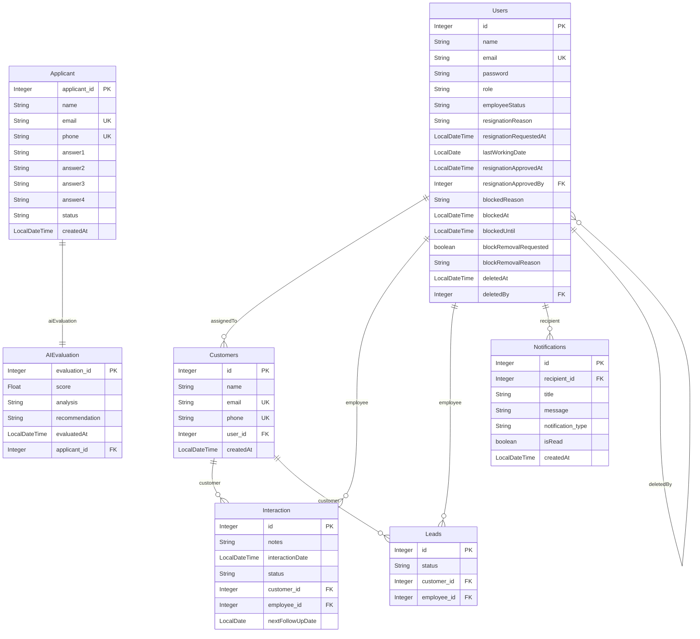

# Enterprise CRM System - Technical & Feature Documentation

This documentation provides an end-to-end technical reference of the **Enterprise Customer Relationship Management (CRM)** application. It covers architecture, entity schemas, data models, functional workflows, business invariants, and the complete REST API interface for reference.

---

## Table of Contents

1. [Project Overview](#1-project-overview)
2. [Data Model](#2-data-model)
3. [Feature Documentation](#3-feature-documentation)
4. [API Reference](#4-api-reference)
5. [Business Rules & Invariants](#5-business-rules--invariants)
6. [Security & Permissions Matrix](#6-security--permissions-matrix)
7. [Known Limitations & Future Improvements](#7-known-limitations--future-improvements)

---

## 1. Project Overview

The Enterprise CRM is a multi-user, multi-service portal designed to coordinate client communication, lead management, employee assignment, recruitment & AI candidate screening, real-time event notifications, AI-powered conversational data analytics, automated daily follow-up email dispatching, and account lifecycle management. The system supports three user categories:

- **Administrators (Admin)**: Oversee employee status (blocking, onboarding approvals, soft deletion, restoration, resignation reviews), monitor global conversion rates, view top performers, manage/reassign customer ownership, review AI-evaluated job applicants, run natural language database queries via AI Chatbot, and trigger real-time system notifications.
- **Employees (Employee)**: Manage assigned customers, log interaction notes with scheduled follow-up dates, update pipeline lead statuses, interact with the AI Chatbot for personal client insights, receive real-time SSE notifications, update passwords, and submit resignation or account unblock appeal requests.
- **Applicants (Job Candidates)**: Register for sales roles via public screening portals, answering technical & scenario-based questions evaluated instantly by an automated AI screening microservice.

### Technical Stack

- **Java Version**: Java 21
- **Backend Framework**: Spring Boot 4.0.5 / 3.x
- **Security Framework**: Spring Security (JWT-based Stateless Authentication, custom `AuthTokenFilter`)
- **Real-Time Communications**: Server-Sent Events (SSE via Spring `SseEmitter` in `SseNotificationService`)
- **Schedulers**: Spring `@Scheduled` tasks for daily email follow-up reminders (`Asia/Kolkata` timezone) and automatic 7-day notification cleanup
- **AI & NLP Chatbot Microservice**: Python 3.13+, FastAPI, Google Gemini AI (`gemini-1.5-flash`), LangChain, SQLAlchemy, PyMySQL, Uvicorn (Port 8000)
- **Applicant AI Evaluation Microservice**: Python 3.13+, FastAPI, Google Gemini AI (`gemini-flash-latest`), Pydantic validation guardrails (Port 8001)
- **Email Microservice**: .NET 9.0 (ASP.NET Core Web API), C#, MailKit / MimeKit, System.Net.Mail (Port 5110)
- **Build Automation**: Maven (Backend), `pip` (Python Microservices), `.NET CLI` (Email Service), Vite (Frontend)
- **Database**: MySQL (5.7+ / 8.x)
- **Object-Relational Mapping (ORM)**: Hibernate / Spring Data JPA (Backend), SQLAlchemy (Chatbot)
- **Frontend**: React 19 (Vite-powered, Tailwind CSS v4, Recharts, Axios, React Hot Toast, Custom AI Chatbot Widget)

### High-Level Architecture Diagram

The application follows a decoupled, multi-service micro-architecture:

```
                       [React 19 Frontend (Vite + Tailwind CSS)]
                                           │
         ┌─────────────────────────────────┼─────────────────────────────────┐
         │ (REST API + JWT)                │ (SSE Stream)                    │ (REST API / JSON)
         ▼                                 ▼                                 ▼
 [Spring Security Filter Chain]      [SSE Controller]             [FastAPI Python AI Chatbot]
  (SecurityConfig/AuthToken)       (Real-Time Notifications)        (Google Gemini 1.5 Flash)
         │                                                                   │
         ▼                                                                   ▼
 [Backend Service Layer]                                           [SQLAlchemy Query Engine]
  (Business Rules & Schedulers)                                     (Safe Read-Only SELECT)
         │                                                                   │
         ├───────────────────┬───────────────────┬───────────────────────────┤
         │ (JPA/Hibernate)   │ (REST Client)     │ (HTTP AI Call)            │ (Database Read)
         ▼                   ▼                   ▼                           ▼
 [MySQL Database]    [.NET Email Service] [Applicant AI Microservice] [MySQL Database]
  (crmSelf_db)       (ASP.NET Core API)   (FastAPI + Gemini AI)       (crmSelf_db)
```

---

## 2. Data Model

### Entities

#### `Users`

Represents an authenticated user (Admin or Employee) in the system.

- **Fields**:
  - `id` (`Integer`, Primary Key, Generated Identity): Unique identifier.
  - `name` (`String`): Full name.
  - `email` (`String`, Unique): User email, used for login.
  - `password` (`String`, `@JsonIgnore`): BCrypt hashed password.
  - `role` (`Role`, Enum as String): `ADMIN` or `EMPLOYEE`.
  - `createdAt` (`LocalDateTime`, `@CreationTimestamp`, Updatable = false): Account registration timestamp.
  - `employeeStatus` (`EmployeeStatus`, Enum as String, Default = `ACTIVE`): Account state.
  - `resignationReason` (`String`, Nullable): Reason specified in resignation request.
  - `resignationRequestedAt` (`LocalDateTime`, Nullable): Resignation request timestamp.
  - `lastWorkingDate` (`LocalDate`, Nullable): Target last day of work.
  - `resignationApprovedAt` (`LocalDateTime`, Nullable): Resignation approval timestamp.
  - `resignationApprovedBy` (`Users`, ManyToOne): Admin who approved the resignation.
  - `blockedReason` (`String`, Nullable): Reason employee was blocked.
  - `blockedAt` (`LocalDateTime`, Nullable): Timestamp of block activation.
  - `blockedUntil` (`LocalDateTime`, Nullable): Expiry timestamp of the block.
  - `blockRemovalRequested` (`boolean`, Default = `false`): Flag requesting unblocking review.
  - `blockRemovalReason` (`String`, Nullable): Explanation sent by the blocked user.
  - `deletedAt` (`LocalDateTime`, Nullable): Timestamp of soft delete.
  - `deletedBy` (`Users`, ManyToOne): Admin who soft-deleted the user.

- **Relationships**:
  - `customers` (`@OneToMany`, mappedBy = "assignedTo"): One user can have many assigned customers. Cascade: None (orphan prevention handled in service layer).
  - `resignationApprovedBy` (`@ManyToOne`, JoinColumn = "resignation_approved_by"): Self-referencing link to the admin user.
  - `deletedBy` (`@ManyToOne`, JoinColumn = "deleted_by"): Self-referencing link to the admin user.

#### `Customers`

Represents a customer profile registered in the database.

- **Fields**:
  - `id` (`Integer`, Primary Key, Generated Identity): Unique identifier.
  - `name` (`String`, Nullable = false): Customer name.
  - `email` (`String`, Unique): Customer email.
  - `phone` (`String`, Unique, Nullable = false): Customer phone number.
  - `createdAt` (`LocalDateTime`, `@CreationTimestamp`, Updatable = false): Registration timestamp.

- **Relationships**:
  - `assignedTo` (`@ManyToOne`, JoinColumn = "user_id"): The User (Employee/Admin) currently responsible for this customer.
  - `interactions` (`@OneToMany`, mappedBy = "customer", Cascade = `ALL`): Interactions associated with this customer. Deleting a customer cascades to delete all their interactions.
  - `leads` (`@OneToMany`, mappedBy = "customer", Cascade = `ALL`): Lead statuses associated with this customer.

#### `Interaction`

Logs activities and follow-ups with customers.

- **Fields**:
  - `id` (`Integer`, Primary Key, Generated Identity): Unique identifier.
  - `notes` (`String`): Action items or details.
  - `interactionDate` (`LocalDateTime`): Date/time the interaction occurred.
  - `status` (`LeadStatus`, Enum as String): Result status of the interaction.
  - `nextFollowUpDate` (`LocalDate`, Nullable): Scheduled follow-up date for automated reminders.

- **Relationships**:
  - `customer` (`@ManyToOne`, JoinColumn = "customer_id"): The target customer.
  - `employee` (`@ManyToOne`, JoinColumn = "employee_id"): The user who conducted the interaction.

#### `Leads`

Pipeline tracking history for conversion analytics.

- **Fields**:
  - `id` (`Integer`, Primary Key, Generated Identity): Unique identifier.
  - `status` (`LeadStatus`, Enum as String): Current status of the lead pipeline.

- **Relationships**:
  - `customer` (`@ManyToOne`, JoinColumn = "customer_id"): The target customer.
  - `employee` (`@ManyToOne`, JoinColumn = "employee_id"): The employee managing this lead.

#### `Notifications`

System alert records dispatched to users and delivered in real-time via SSE.

- **Fields**:
  - `id` (`Integer`, Primary Key, Generated Identity): Unique identifier.
  - `recipient` (`Users`, ManyToOne, JoinColumn = "recipient_id"): User receiving the alert.
  - `title` (`String`): Alert header text.
  - `message` (`String`): Notification body description.
  - `type` (`NotificationType`, Enum as String): Category (`CUSTOMER_REASSIGNED`, `RESIGNATION_APPROVED`, `RESIGNATION_PENDING`, `DELETED`).
  - `isRead` (`boolean`, Default = `false`): Read/unread status flag.
  - `createdAt` (`LocalDateTime`): Creation timestamp.

#### `Applicant`

Stores candidate registration and screening responses for recruitment.

- **Fields**:
  - `id` (`Integer`, Primary Key, Generated Identity, Column = `applicant_id`): Unique identifier.
  - `name` (`String`, Nullable = false): Candidate full name.
  - `email` (`String`, Unique, Nullable = false): Candidate email.
  - `phone` (`String`, Unique, Nullable = false): Candidate contact phone number.
  - `password` (`String`, `@JsonIgnore`): Encoded initial credentials for account creation upon acceptance.
  - `answer1`, `answer2`, `answer3`, `answer4` (`String`): Candidate responses to screening evaluation questions.
  - `status` (`ApplicationStatus`, Enum as String, Default = `PENDING`): Application decision state (`PENDING`, `ACCEPTED`, `REJECTED`).
  - `createdAt` (`LocalDateTime`, `@CreationTimestamp`): Submission timestamp.

- **Relationships**:
  - `aiEvaluation` (`@OneToOne`, mappedBy = "applicant", Cascade = `ALL`): Evaluation score and analysis produced by AI.

#### `AIEvaluation`

AI assessment generated by Gemini AI for job applicants.

- **Fields**:
  - `id` (`Integer`, Primary Key, Generated Identity, Column = `evaluation_id`): Unique identifier.
  - `score` (`Float`, Nullable = false): Calculated suitability score (e.g. 0.0 - 100.0).
  - `analysis` (`String`, Length = 2000): Detailed qualitative strengths & weaknesses summary written by Gemini AI.
  - `recommendation` (`Recommendation`, Enum as String): AI decision tag (`SHORTLIST`, `REVIEW`, `NOT_RECOMMENDED`).
  - `evaluatedAt` (`LocalDateTime`, `@CreationTimestamp`): Timestamp of AI evaluation processing.

- **Relationships**:
  - `applicant` (`@OneToOne`, JoinColumn = "applicant_id", Unique = true): Associated applicant.

---

### ER Diagram Description


```mermaid
erDiagram
    Users {
        Integer id PK
        String name
        String email UK
        String password
        String role
        String employeeStatus
        String resignationReason
        LocalDateTime resignationRequestedAt
        LocalDate lastWorkingDate
        LocalDateTime resignationApprovedAt
        Integer resignationApprovedBy FK
        String blockedReason
        LocalDateTime blockedAt
        LocalDateTime blockedUntil
        boolean blockRemovalRequested
        String blockRemovalReason
        LocalDateTime deletedAt
        Integer deletedBy FK
    }
    Customers {
        Integer id PK
        String name
        String email UK
        String phone UK
        Integer user_id FK
        LocalDateTime createdAt
    }
    Interaction {
        Integer id PK
        String notes
        LocalDateTime interactionDate
        String status
        Integer customer_id FK
        Integer employee_id FK
        LocalDate nextFollowUpDate
    }
    Leads {
        Integer id PK
        String status
        Integer customer_id FK
        Integer employee_id FK
    }
    Notifications {
        Integer id PK
        Integer recipient_id FK
        String title
        String message
        String notification_type
        boolean isRead
        LocalDateTime createdAt
    }
    Applicant {
        Integer applicant_id PK
        String name
        String email UK
        String phone UK
        String answer1
        String answer2
        String answer3
        String answer4
        String status
        LocalDateTime createdAt
    }
    AIEvaluation {
        Integer evaluation_id PK
        Float score
        String analysis
        String recommendation
        LocalDateTime evaluatedAt
        Integer applicant_id FK
    }

    Users ||--o{ Customers : "assignedTo"
    Users ||--o{ Interaction : "employee"
    Users ||--o{ Leads : "employee"
    Users ||--o{ Notifications : "recipient"
    Customers ||--o{ Interaction : "customer"
    Customers ||--o{ Leads : "customer"
    Users ||--o{ Users : "resignationApprovedBy"
    Users ||--o{ Users : "deletedBy"
    Applicant ||--|| AIEvaluation : "aiEvaluation"
```

---

### Enums

#### `Role`

- `ADMIN`: Access to administrative endpoints, user list actions, access requests review, recruitment management, global AI query analytics, and system notifications.
- `EMPLOYEE`: Access to assigned customer records, logging interactions, personal AI query insights, password updates, and resignation/appeal submissions.

#### `LeadStatus`

- `NEW`: Freshly registered customer account.
- `CONTACTED`: Initial client engagement completed.
- `INTERESTED`: Customer showed active interest in conversion.
- `NOT_INTERESTED`: Customer rejected offers or opted out.
- `CLOSED`: Successfully converted deal (won).
- `PENDING`: Ongoing negotiation or proposal review.

#### `EmployeeStatus`

- `PENDING`: Registered guest awaiting admin approval. Authentication blocked.
- `ACTIVE`: Normal operating state with full feature access.
- `PENDING_RESIGNATION`: Submitted resignation request; awaiting admin review.
- `RESIGNED`: Offboarded user. Authentication blocked.
- `BLOCKED`: Locked user. Allowed to log in, but redirected to lockout panel and blocked on `/api/**` with 403 Forbidden.
- `DELETED`: Soft-deleted employee. Authentication blocked.

#### `ApplicationStatus`

- `PENDING`: Submitted candidate application awaiting admin decision.
- `ACCEPTED`: Approved applicant converted into active employee account.
- `REJECTED`: Declined applicant.

#### `Recommendation`

- `SHORTLIST`: Top-tier candidate recommendation from AI.
- `REVIEW`: Moderate candidate requiring manual human review.
- `NOT_RECOMMENDED`: Low candidate fit score.

#### `NotificationType`

- `CUSTOMER_REASSIGNED`: Alert triggered when customers are transferred to an Admin.
- `RESIGNATION_APPROVED`: Alert sent when an employee resignation is accepted.
- `RESIGNATION_PENDING`: Alert dispatched to Admins when an employee requests resignation.
- `DELETED`: Alert sent when an employee profile is soft-deleted.

---

## 3. Feature Documentation

### User Authentication & Role-Based Access

- **Purpose**: Secure CRM access, verify role permissions, and enforce employee account state rules.
- **Trigger / Entry Point**:
  - `POST /auth/signin`
  - Body: `{"email": "...", "password": "..."}`
  - Response: `{"token": "...", "role": "...", "id": ..., "name": "..."}`
- **Preconditions**: User status must not be `PENDING`, `RESIGNED`, or `DELETED`.
- **Step-by-step Flow**:
  1. Frontend sends credentials to `/auth/signin`.
  2. Spring Security `AuthenticationManager` verifies credentials against the database.
  3. If user is `PENDING`, throws `DisabledException` ("Your account access request is pending administrator approval.").
  4. If user is `DELETED` or `RESIGNED`, authentication fails.
  5. If user is `BLOCKED` and block duration has expired (current time is past `blockedUntil`), the filter chain clears the block and converts status back to `ACTIVE`. If block is active, authentication succeeds but `/api/**` routes are restricted to the unblock request endpoint.
  6. On successful authentication, generates a JWT token containing claims, roles, and username.
- **Data Changes**: Reads `Users` table; updates status to `ACTIVE` if block expires.
- **Edge Cases & Error Handling**: Invalid password returns `401 Unauthorized` with `"Bad credentials"`.

---

### AI-Powered Natural Language to SQL Chatbot (`/chatbot`)

- **Purpose**: Translates plain text natural language questions into safe SQL queries using Google Gemini AI, executes them on MySQL, and converts database results into natural conversational responses.
- **Trigger / Entry Point**:
  - Frontend AI Chatbot Widget -> `POST /api/chat/sql`
  - Body: `{"question": "How many leads were closed this month?", "user_role": "ADMIN", "user_id": 1}`
- **Preconditions**: Valid authenticated user session (`ADMIN` or `EMPLOYEE`).
- **Step-by-step Flow**:
  1. User types a question in the floating `ChatbotWidget` component.
  2. Frontend sends query with user context (`user_role` & `user_id`) to the Python FastAPI microservice (Port 8000).
  3. Google Gemini AI (`gemini-1.5-flash` via LangChain) interprets the prompt, reads database schema context, and generates a structured SQL query.
  4. If caller is an `EMPLOYEE`, role-based security rules append `WHERE user_id = {user_id}` constraints to enforce customer privacy. If `ADMIN`, global queries are permitted.
  5. Security guardrail checks generated SQL to ensure it is strictly a read-only `SELECT` statement (blocks `DROP`, `UPDATE`, `DELETE`, or `INSERT`).
  6. Query is executed via SQLAlchemy on MySQL, and Gemini formats the output data into a natural language response.
- **Data Changes**: Read-only database queries with SQL safety verification.

---

### AI Candidate Screening & Recruitment Workflow (`/Applicatant AI Analysis`)

- **Purpose**: Automates candidate screening by evaluating applicant responses to screening questions using Google Gemini AI, assigning scores and recommendations, and converting accepted applicants into employee accounts.
- **Trigger / Entry Point**:
  - Candidate: `POST /api/recruitment/register`
  - Admin: `GET /api/recruitment/applicants`, `PUT /api/recruitment/applicants/{id}/accept`, `PUT /api/recruitment/applicants/{id}/reject`
- **Preconditions**: Unique email and phone for applicants. Admin authentication required for reviews.
- **Step-by-step Flow**:
  1. Job candidate fills out application with 4 screening answers on the recruitment portal.
  2. `RecruitmentServiceImpl` saves applicant with status `PENDING` and makes an HTTP call to the `Applicatant AI Analysis` FastAPI service (Port 8001, `/api/ai/evaluate`).
  3. Gemini AI (`models/gemini-flash-latest`) analyzes responses against domain sales competency criteria, producing a numerical `score`, qualitative `analysis`, and a `recommendation` (`SHORTLIST`, `REVIEW`, `NOT_RECOMMENDED`).
  4. AI evaluation result is persisted into `AIEvaluation` linked 1-to-1 with `Applicant`.
  5. Admin views applicant dashboard sorted by AI evaluation score, reviews candidate analysis, and clicks **Accept** or **Reject**.
  6. Accepting an applicant updates status to `ACCEPTED` and automatically provisions a new `EMPLOYEE` user record in the `Users` table with encoded credentials.
- **Data Changes**: Inserts `Applicant` and `AIEvaluation` rows. On acceptance, inserts a new `Users` record.

---

### Real-Time Push Notifications (Server-Sent Events)

- **Purpose**: Establishes a persistent, lightweight server-to-client push channel delivering live system notifications without requiring polling.
- **Trigger / Entry Point**:
  - `GET /api/notifications/stream` (EventSource stream connection)
- **Preconditions**: Authenticated user session.
- **Step-by-step Flow**:
  1. Frontend initializes an `EventSource` connection to `/api/notifications/stream`.
  2. Spring `NotificationSseController` delegates to `SseNotificationService`, registering an `SseEmitter` session mapped to the user ID.
  3. When administrative actions occur (such as resignation requests, onboarding approvals, or customer transfers), `NotificationServiceImpl` persists a `Notifications` entity and pushes the payload in real-time over the active SSE connection.
  4. Frontend receives event payloads live, rendering toast notifications and updating unread badge counts dynamically.
- **Data Changes**: Memory emitter registration in `ConcurrentHashMap`. Persists `Notifications` entity in DB.

---

### Dedicated .NET Email Microservice & Automated Follow-Up Reminders

- **Purpose**: Offloads email generation/delivery to an isolated ASP.NET Core microservice and sends automated daily follow-up reminders to sales representatives.
- **Trigger / Entry Point**:
  - REST Call: `POST /api/email/send`
  - Automated Scheduler: `FollowUpReminderScheduler` (`@Scheduled` cron)
- **Preconditions**: Valid SMTP credentials configured in .NET `appsettings.json`.
- **Step-by-step Flow**:
  1. `FollowUpReminderScheduler` runs daily at configured cron schedule (Asia/Kolkata timezone).
  2. Queries `Interaction` table for interactions where `nextFollowUpDate` equals today (`LocalDate.now()`).
  3. Groups matching interactions by assigned employee (`Users`).
  4. Formats email body and dispatches asynchronous HTTP POST requests to `.NET CrmEmailService` (Port 5110).
  5. .NET service constructs MIME emails using MailKit and delivers via SMTP.
- **Data Changes**: Reads `Interaction` and `Users` tables. External SMTP dispatch logging.

---

### Notification Cleanup Scheduler

- **Purpose**: Prevents notification table bloat by automatically deleting outdated notification records.
- **Trigger / Entry Point**:
  - `NotificationCleanupScheduler` (`@Scheduled` cron `crm.notification.cleanup.cron`)
- **Preconditions**: Spring Boot application running with scheduling enabled (`@EnableScheduling`).
- **Step-by-step Flow**:
  1. Scheduler triggers at defined cron interval.
  2. Calculates cutoff timestamp (`LocalDateTime.now().minusDays(7)`).
  3. Deletes all notification rows where `createdAt` is older than 7 days.
- **Data Changes**: Bulk deletes expired rows from `notifications` table.

---

### Onboarding Access Requests

- **Purpose**: Allows external individuals to apply for an employee account with administrative approval.
- **Trigger / Entry Point**:
  - `POST /auth/request-access`
  - Body: `{"name": "...", "email": "...", "password": "..."}`
- **Preconditions**: Email must be unique.
- **Step-by-step Flow**:
  1. Guest submits full registration info.
  2. Backend hashes password, saves the user record with role `EMPLOYEE` and status `PENDING`.
  3. Admin logs into dashboard and views pending access requests (`GET /api/admin/access-requests`).
  4. Admin clicks `POST /api/admin/access-requests/{id}/approve` (updates status to `ACTIVE`) or `POST /api/admin/access-requests/{id}/reject` (updates status to `DELETED`).
- **Data Changes**: Inserts `Users` record. Updates `employeeStatus` to `ACTIVE` or `DELETED`.

---

### Customer Management (Create / Assign / Update)

- **Purpose**: Register and manage customer profiles and sales rep assignments.
- **Trigger / Entry Point**:
  - `POST /api/customers`, `PUT /api/customers/{id}`
- **Preconditions**: Unique email and phone constraints. Authenticated session.
- **Step-by-step Flow**:
  1. If caller is an `EMPLOYEE`, customer is automatically assigned to that employee (`user_id = employee.id`).
  2. If caller is an `ADMIN`, admin specifies `assignedToUserId`. If omitted, throws `"Admin must assign customer to an Employee"`.
  3. Inserts customer record and initializes status to `NEW` in `Leads` table.
- **Data Changes**: Writes row to `Customers` table. Writes initial pipeline status to `Leads` table.

---

### Customer Interaction Logging

- **Purpose**: Record all interaction notes with clients to establish a communication timeline and schedule follow-ups.
- **Trigger / Entry Point**:
  - `POST /api/interaction`
  - Body: `{"customerId": 1, "notes": "...", "status": "CONTACTED", "nextFollowUpDate": "2026-08-15"}`
- **Preconditions**: Target customer exists and belongs to employee (or caller is Admin).
- **Step-by-step Flow**:
  1. Retrieve customer and current employee context.
  2. Save `Interaction` record with notes, status, and scheduled `nextFollowUpDate`.
  3. Automatically create/update a record in the `Leads` table mapping customer's current status.
- **Data Changes**: Writes `Interaction` record. Updates/Inserts `Leads` status matching selected status.

---

### Employee Resignation & Customer Reassignment

- **Purpose**: Handles employee offboarding gracefully without abandoning customer relationships.
- **Trigger / Entry Point**:
  - Employee: `POST /api/employee/resign` -> `{"resignationReason": "..."}`
  - Admin: `PUT /api/admin/employees/{id}/approve-resignation`
- **Preconditions**: Employee must be `ACTIVE`. Admin must be authenticated.
- **Step-by-step Flow**:
  1. Employee submits resignation reason. Status shifts to `PENDING_RESIGNATION`. Dispatches SSE notification to all Admins.
  2. Admin reviews request and approves.
  3. Status shifts to `RESIGNED`. `resignationApprovedAt` and `resignationApprovedBy` are populated.
  4. Queries all customers assigned to the resigning employee.
  5. Reassigns all of them to the approving Admin's ID to prevent orphan records, dispatching real-time SSE alerts.
- **Data Changes**: Updates `Users` status. Updates `user_id` foreign key on assigned `Customers` records.

---

### Employee Soft Deletion & Recovery

- **Purpose**: Soft delete employee accounts to preserve historical records, with full capability to restore them.
- **Trigger / Entry Point**:
  - Soft Delete: `DELETE /api/admin/employees/{id}`
  - Restore: `PUT /api/admin/employees/{id}/restore`
- **Preconditions**: Admins cannot be deleted. Target user must exist.
- **Step-by-step Flow**:
  1. Soft Delete: Sets `employeeStatus` to `DELETED`, records `deletedAt` and `deletedBy`. Reassigns all owned customers to deleting Admin.
  2. Restore: Sets `employeeStatus` back to `ACTIVE`, clears `deletedAt` and `deletedBy` fields to `null`.
- **Data Changes**: Updates `Users` table fields. Updates `user_id` foreign keys in `Customers` table upon deletion.

---

### Account Blocking & Appeal Process

- **Purpose**: Lock employee access temporarily for audit or security reasons while supporting an appeal review workflow.
- **Trigger / Entry Point**:
  - Admin block: `PUT /api/admin/employees/{id}/block`
  - Employee appeal: `POST /api/employee/request-unblock`
  - Admin unblock: `PUT /api/admin/employees/{id}/unblock`
- **Preconditions**: Admins cannot block other admins. Employee must be active.
- **Step-by-step Flow**:
  1. Admin blocks employee with duration (days) and reason. Status shifts to `BLOCKED`, setting `blockedUntil`.
  2. Blocked employee logs in: redirected to lockout appeal view. `/api/**` endpoints return 403 Forbidden.
  3. Employee submits appeal: sets `blockRemovalRequested = true` and records `blockRemovalReason`.
  4. Admin reviews blocked employees list (`GET /api/admin/employees/blocked`) and clicks unblock: status returns to `ACTIVE`, clearing block metadata.
- **Data Changes**: Updates block properties on `Users` table.

---

### Database Pagination & Search (Customers)

- **Purpose**: Enables administrators to browse extensive customer databases with optimized performance using pagination, multi-column sorting, and name-based search queries.
- **Trigger / Entry Point**:
  - `GET /api/admin/customers`
  - Query parameters: `search` (String), `page` (int), `size` (int), `sort` (String)
- **Preconditions**: Admin authentication required.
- **Step-by-step Flow**:
  1. Admin opens Customers section in dashboard.
  2. Frontend sends request to `/api/admin/customers` with `page`, `size`, and optional `search` query parameters.
  3. Database executes a paginated Spring Data JPA query, filtering by case-insensitive name matching.
  4. Backend returns a `Page<CustomerResponseDto>` containing records and metadata (`totalPages`, `totalElements`, `pageNumber`).
  5. Frontend renders paginated rows and navigation controls.
- **Data Changes**: Read-only paginated database queries.

---

### User Password Management

- **Purpose**: Allows employees and administrators to securely change their login credentials.
- **Trigger / Entry Point**:
  - `POST /api/employee/update-password`
  - Body: `{"currentPassword": "...", "newPassword": "..."}`
- **Preconditions**: Authenticated user session. Current password must match database record.
- **Step-by-step Flow**:
  1. User submits current password and new password in settings panel.
  2. Backend verifies `currentPassword` using BCrypt encoder against stored hash.
  3. Hashes `newPassword` with BCrypt and updates `Users` entity.
  4. Triggers password change confirmation email via .NET Email Microservice.
- **Data Changes**: Updates `password` hash column in `Users` table.

---

## 4. API Reference

### Auth Controller (`/auth`)

| Method | Endpoint               | Role Required | Description                                  | Request Body            | Response          |
| :----- | :--------------------- | :------------ | :------------------------------------------- | :---------------------- | :---------------- |
| `POST` | `/auth/signin`         | Public        | Authenticates credentials, returns JWT token. | `LoginRequestDto`       | `LoginResponseDto`|
| `POST` | `/auth/register`       | `ADMIN`       | Directly registers an employee.              | `RegisterRequestDto`    | String Message    |
| `POST` | `/auth/request-access` | Public        | Submits pending onboarding access request.   | `RegisterRequestDto`    | String Message    |
| `GET`  | `/auth/profile`        | Authenticated | Fetches profile of currently logged-in user. | None                    | `UserResponseDto` |

### Admin Controller (`/api/admin`)

| Method   | Endpoint                                        | Role Required | Description                                                         | Request Body      | Response                       |
| :------- | :---------------------------------------------- | :------------ | :------------------------------------------------------------------ | :---------------- | :----------------------------- |
| `GET`    | `/api/admin/employees`                          | `ADMIN`       | Lists all registered employees.                                     | None              | `List<EmployeeResponseDto>`    |
| `GET`    | `/api/admin/employees/{id}`                     | `ADMIN`       | Fetches details of a specific employee.                             | None              | `EmployeeResponseDto`          |
| `GET`    | `/api/admin/customers`                          | `ADMIN`       | Fetches customers with pagination, sorting, and name-based search.  | Query params      | `Page<CustomerResponseDto>`    |
| `GET`    | `/api/admin/employee/{id}/customers`            | `ADMIN`       | Lists customers owned by a specific employee.                       | None              | `List<CustomerResponseDto>`    |
| `GET`    | `/api/admin/interactions`                       | `ADMIN`       | Lists all logged customer interactions.                             | None              | `List<InteractionResponseDto>` |
| `GET`    | `/api/admin/leads/count`                        | `ADMIN`       | Total count of all leads.                                           | None              | `Long`                         |
| `GET`    | `/api/admin/leads/closed`                       | `ADMIN`       | Count of closed (won) leads.                                        | None              | `Long`                         |
| `GET`    | `/api/admin/analytics/conversion-rate`          | `ADMIN`       | Percentage of global leads converted.                               | None              | `Double`                       |
| `GET`    | `/api/admin/analytics/best-employee`            | `ADMIN`       | Top-performing employee based on closed sales.                      | None              | `BestEmployeeDto`              |
| `GET`    | `/api/admin/employees/resignations`             | `ADMIN`       | Lists pending employee resignation requests.                        | None              | `List<EmployeeResponseDto>`    |
| `PUT`    | `/api/admin/employees/{id}/approve-resignation` | `ADMIN`       | Approves employee resignation & reassigns customers.                | None              | String Message                 |
| `PUT`    | `/api/admin/employees/{id}/reject-resignation`  | `ADMIN`       | Rejects employee resignation request.                               | None              | String Message                 |
| `PUT`    | `/api/admin/employees/{id}/block`               | `ADMIN`       | Blocks user for specified days.                                     | `BlockRequestDto` | String Message                 |
| `PUT`    | `/api/admin/employees/{id}/unblock`             | `ADMIN`       | Re-activates a blocked employee.                                    | None              | String Message                 |
| `GET`    | `/api/admin/employees/blocked`                  | `ADMIN`       | Lists all currently blocked users.                                  | None              | `List<EmployeeResponseDto>`    |
| `DELETE` | `/api/admin/employees/{id}`                     | `ADMIN`       | Soft-deletes an employee and reassigns customers.                   | None              | String Message                 |
| `GET`    | `/api/admin/employees/deleted`                  | `ADMIN`       | Lists all soft-deleted employees.                                   | None              | `List<EmployeeResponseDto>`    |
| `PUT`    | `/api/admin/employees/{id}/restore`             | `ADMIN`       | Restores a soft-deleted employee back to `ACTIVE`.                  | None              | String Message                 |
| `GET`    | `/api/admin/access-requests`                    | `ADMIN`       | Lists pending onboarding access requests.                           | None              | `List<EmployeeResponseDto>`    |
| `POST`   | `/api/admin/access-requests/{id}/approve`       | `ADMIN`       | Activates pending onboarding access requests.                       | None              | String Message                 |
| `POST`   | `/api/admin/access-requests/{id}/reject`        | `ADMIN`       | Rejects and soft-deletes access requests.                           | None              | String Message                 |

### Customer Controller (`/api/customers`)

| Method | Endpoint                        | Role Required       | Description                                 | Request Body         | Response                    |
| :----- | :------------------------------ | :------------------ | :------------------------------------------ | :------------------- | :-------------------------- |
| `POST` | `/api/customers`                | `ADMIN`, `EMPLOYEE` | Registers a new customer profile.           | `CustomerRequestDto` | `CustomerResponseDto`       |
| `GET`  | `/api/customers/my`             | `ADMIN`, `EMPLOYEE` | Fetch customers assigned to logged-in user. | None                 | `List<CustomerResponseDto>` |
| `GET`  | `/api/customers/interested`     | `ADMIN`, `EMPLOYEE` | Fetch interested status customers.          | None                 | `List<CustomerResponseDto>` |
| `GET`  | `/api/customers/not-interested` | `ADMIN`, `EMPLOYEE` | Fetch not-interested status customers.      | None                 | `List<CustomerResponseDto>` |
| `GET`  | `/api/customers/closed`         | `ADMIN`, `EMPLOYEE` | Fetch closed won customers.                 | None                 | `List<CustomerResponseDto>` |
| `GET`  | `/api/customers/pending`        | `ADMIN`, `EMPLOYEE` | Fetch negotiating/pending customers.        | None                 | `List<CustomerResponseDto>` |
| `GET`  | `/api/customers/{id}`           | `ADMIN`, `EMPLOYEE` | Fetch customer by ID.                       | None                 | `CustomerResponseDto`       |
| `PUT`  | `/api/customers/{id}`           | `ADMIN`, `EMPLOYEE` | Updates customer info & assignment.         | `CustomerRequestDto` | `CustomerResponseDto`       |

### Employee Controller (`/api/employee`)

| Method | Endpoint                                        | Role Required       | Description                                     | Request Body              | Response               |
| :----- | :---------------------------------------------- | :------------------ | :---------------------------------------------- | :------------------------ | :--------------------- |
| `POST` | `/api/employee/resign`                          | `EMPLOYEE`          | Submits resignation request with reason.        | `ResignationRequestDto`   | String Message         |
| `POST` | `/api/employee/request-unblock`                 | `EMPLOYEE`          | Submits block removal appeal request.           | `{"reason": "..."}`       | String Message         |
| `POST` | `/api/employee/update-password`                 | `ADMIN`, `EMPLOYEE` | Updates user password with BCrypt verification. | `UpdatePasswordRequestDto`| Map JSON Response      |
| `GET`  | `/api/employee/analytics/conversion-rate/{id}` | `ADMIN`, `EMPLOYEE` | Calculates conversion rate for specific employee| None                      | `Double`               |

### Interaction, Lead & Dashboard Controllers

| Method | Endpoint                         | Role Required       | Description                          | Request Body            | Response                       |
| :----- | :------------------------------- | :------------------ | :----------------------------------- | :---------------------- | :----------------------------- |
| `POST` | `/api/interaction`               | `ADMIN`, `EMPLOYEE` | Creates interaction note & follow-up.| `InteractionRequestDto` | String Message                 |
| `GET`  | `/api/interaction/customer/{id}` | `ADMIN`, `EMPLOYEE` | Lists interactions for customer.     | None                    | `List<InteractionResponseDto>` |
| `PUT`  | `/api/leads/{customerId}/status` | `ADMIN`, `EMPLOYEE` | Updates customer lead pipeline state.| `LeadStatusRequest`     | String Message                 |
| `GET`  | `/api/dashboard/customers/count` | `ADMIN`, `EMPLOYEE` | Returns customer count metric.       | `employeeId` (Optional) | `Long`                         |

### Notification Controller (`/api/notifications`)

| Method | Endpoint                            | Role Required | Description                                                         |
| :----- | :---------------------------------- | :------------ | :------------------------------------------------------------------ |
| `GET`  | `/api/notifications/stream`         | Authenticated | Establishes persistent Server-Sent Events (SSE) stream connection.  |
| `GET`  | `/api/notifications`                | Authenticated | Retrieves list of notifications for currently logged-in user.      |
| `GET`  | `/api/notifications/unread-count`   | Authenticated | Returns count of unread notifications.                              |
| `PUT`  | `/api/notifications/{id}/read`      | Authenticated | Marks a specific notification as read.                              |
| `PUT`  | `/api/notifications/mark-all-read`  | Authenticated | Marks all unread notifications as read for current user.            |

### Recruitment Controller (`/api/recruitment`)

| Method | Endpoint                           | Role Required | Description                                                         |
| :----- | :--------------------------------- | :------------ | :------------------------------------------------------------------ |
| `POST` | `/api/recruitment/register`        | Public        | Submits candidate registration & screening answers for AI scoring.  |
| `GET`  | `/api/recruitment/applicants`      | `ADMIN`       | Fetches all applicants sorted by AI evaluation score.               |
| `GET`  | `/api/recruitment/applicants/{id}` | `ADMIN`       | Fetches detailed applicant profile and screening answers.           |
| `GET`  | `/api/recruitment/applicants/{id}/evaluation` | `ADMIN` | Fetches standalone AI evaluation score & analysis text.  |
| `PUT`  | `/api/recruitment/applicants/{id}/accept`    | `ADMIN` | Approves applicant and creates an active `EMPLOYEE` user account. |
| `PUT`  | `/api/recruitment/applicants/{id}/reject`    | `ADMIN` | Rejects applicant application.                                   |

### External Microservices Endpoints

| Service / Endpoint                  | Method | Access Role   | Description                                                                       |
| :---------------------------------- | :----- | :------------ | :-------------------------------------------------------------------------------- |
| `/api/chat/sql` (FastAPI Chatbot)   | `POST` | Authenticated | Translates natural language queries into safe SQL & returns conversational text.  |
| `/api/ai/evaluate` (Applicant AI)   | `POST` | Internal API  | Evaluates sales candidate responses using Gemini AI & generates score/analysis.   |
| `/api/email/send` (.NET Service)    | `POST` | Internal API  | Asynchronous email dispatch service via ASP.NET Core & MailKit.                   |

---

## 5. Business Rules & Invariants

- **Single Assignee Constraint**: Every customer registered in the system must be assigned to exactly one user (Admin or Employee) at all times.
- **Orphan Customer Prevention**: Under no circumstances can a customer be left assigned to an inactive or soft-deleted user. If an employee is soft-deleted or has their resignation approved, all their customers must be automatically reassigned to the approving/deleting Admin.
- **Admin Blocking Restriction**: Administrators cannot block other administrators.
- **Blocked User Limitations**: Blocked employees can log in and submit unblock appeals, but security filters intercept all other `/api/**` resource requests with 403 Forbidden.
- **Soft Delete Persistence**: Soft-deleted or resigned employees cannot be assigned new customers and are excluded from active user dropdowns.
- **AI SQL Execution Safety**: All SQL queries generated by the Python AI Chatbot are restricted to read-only `SELECT` statements. Employee queries strictly include `WHERE user_id = ...` filters to prevent cross-user data exposure.
- **Applicant Screening AI Guardrails**: Candidate answers are sanitized and validated via Pydantic models prior to sending to Gemini AI. Output evaluation structures strictly conform to expected JSON schemas with explicit fallbacks.

---

## 6. Security & Permissions Matrix

| Operations / Resources                       | Admin Permission | Employee Permission | Applicant / Public |
| :------------------------------------------- | :--------------: | :-----------------: | :----------------: |
| Authenticate / Signin                        |       Yes        |         Yes         |         No         |
| Submit Job Application (Recruitment)        |        No        |         No          |        Yes         |
| Apply for Onboarding Access                  |        No        |         No          |        Yes         |
| Approve / Reject Onboardings & Applicants    |       Yes        |         No          |         No         |
| Block / Unblock Employees                    |       Yes        |         No          |         No         |
| Soft-Delete / Restore Employees              |       Yes        |         No          |         No         |
| Approve / Reject Resignation Requests        |       Yes        |         No          |         No         |
| Submit Resignation Request                   |        No        |         Yes         |         No         |
| Submit Unblock Appeals                       |        No        |         Yes         |         No         |
| Update Personal Account Password             |       Yes        |         Yes         |         No         |
| View Global Conversion Rate / Top Performers |       Yes        |         No          |         No         |
| View All Employees                           |       Yes        |         No          |         No         |
| Create Customers                             | Yes (With Assign)| Yes (Auto-assigned) |         No         |
| Read / Update Owned Customers                |       Yes        |         Yes         |         No         |
| View Global Customer Database (Paginated)    |       Yes        |         No          |         No         |
| Log Interaction & Schedule Follow-ups        |       Yes        |         Yes         |         No         |
| Run Natural Language AI Database Queries     | Yes (Global Data)| Yes (Scoped Data)   |         No         |
| Receive Real-Time SSE Notifications          |       Yes        |         Yes         |         No         |

---

## 7. Known Limitations & Future Improvements

1. **Restoring Soft-Deleted Employees**:
   - _Status_: **Implemented**.
   - _Description_: Endpoint `/api/admin/employees/{id}/restore` resets status to `ACTIVE` and clears delete metadata. UI includes a "Restore Employee" action in the Employee Management panel for archived employees.

2. **Database Pagination & Search**:
   - _Status_: **Implemented**.
   - _Description_: Endpoint `/api/admin/customers` accepts Spring Data `Pageable` parameters for pagination, sorting, and name-based search queries. Frontend renders interactive pagination controls and live search input.

3. **Real-time Event Notifications**:
   - _Status_: **Implemented**.
   - _Description_: Implemented via Spring Boot SSE controller (`NotificationSseController`) and `SseNotificationService`, delivering live alerts to connected React frontend clients with auto-cleanup schedulers.

4. **AI-Powered Natural Language Analytics**:
   - _Status_: **Implemented**.
   - _Description_: Powered by Python FastAPI, Google Gemini AI (`gemini-1.5-flash`), and SQLAlchemy with role-based data security and SQL execution safety checks.

5. **AI Candidate Screening & Recruitment**:
   - _Status_: **Implemented**.
   - _Description_: Integrated FastAPI microservice using Gemini AI to evaluate sales candidate screening answers, assigning suitability scores, qualitative analysis, and automated employee account provisioning upon acceptance.

6. **Automated Follow-up Email Reminders**:
   - _Status_: **Implemented**.
   - _Description_: Spring `@Scheduled` cron job queries interactions scheduled for the current day, groups them by sales rep, and dispatches reminder digests via the C# .NET Email microservice.

7. **Customer Reassignment Audit Trail (Future Improvement)**:
   - _Status_: Reassignments executed during resignations or soft deletions transfer customer ownership cleanly in the database, but historical logs of past assignments are not stored separately.
   - _Improvement_: Introduce a dedicated `ReassignmentLog` entity to record historical transfers, timestamps, and triggering administrative actions for auditing purposes.
