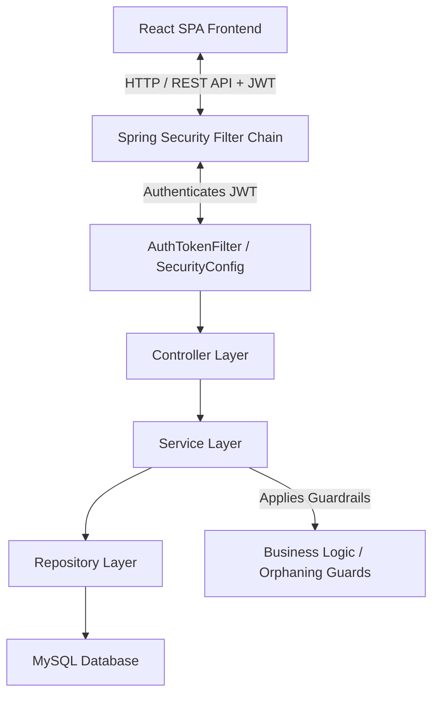
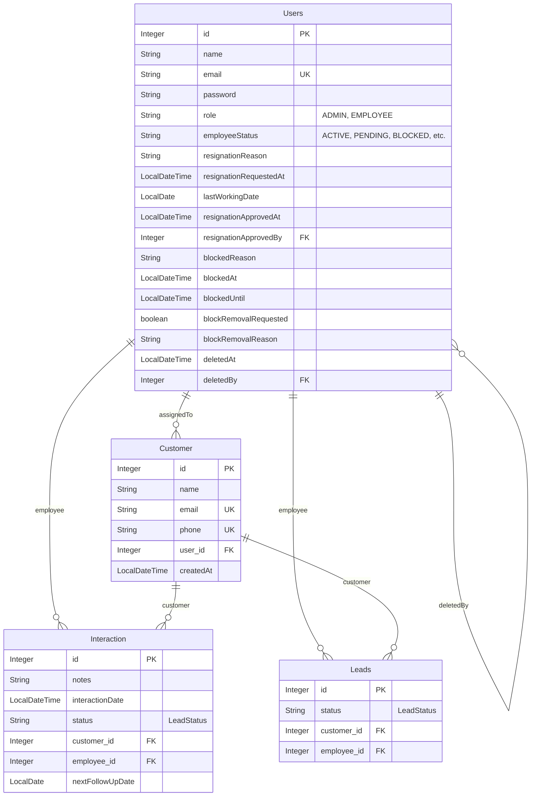

# 🏢 Enterprise Customer Relationship Management (CRM) System

[](https://www.oracle.com/java/)
[](https://spring.io/projects/spring-boot)
[](https://react.dev/)
[](https://tailwindcss.com/)
[](https://www.mysql.com/)
[](https://vite.dev/)

An enterprise-grade, full-stack **Customer Relationship Management (CRM)** application designed to streamline customer onboarding, lead pipeline tracking, interactive communications history, and employee lifecycle management (active, block-appeals, resignations, and soft-deletes).

Built on a robust architecture featuring a **Spring Boot REST API** (Java 21, Hibernate, Spring Security, JWT) and a **React Single Page Application** (Vite, Tailwind CSS, Recharts).

---

## 📖 Table of Contents

1. [Project Overview](#-project-overview)
2. [Key Features](#-key-features)
3. [Technology Stack](#-technology-stack)
4. [System Architecture](#-system-architecture)
5. [Database Model & ER Diagram](#-database-model--er-diagram)
6. [API Reference Directory](#-api-reference-directory)
7. [Repository Folder Structure](#-repository-folder-structure)
8. [Installation & Local Setup](#-installation--local-setup)
9. [Business Logic & Guardrails](#-business-logic--guardrails)
10. [Documentation Reference](#-documentation-reference)

---

## 🌟 Project Overview

The Enterprise CRM supports two primary user personas with specialized, authenticated views:

- **Administrators (Admin)**: Empowered to monitor global analytics (such as top-performing employees and lead conversion rates), onboard new staff, evaluate employee block/unblock requests, review resignation submissions, and delete or restore employee profiles. All orphaned customers are automatically reassigned to Admins to maintain continuity.
- **Employees (Employee)**: Responsible for managing their assigned customers, editing client profiles, registering interactions, tracking the conversion pipeline stage (leads), and requesting unblocks or submitting resignation requests.

---

## 🚀 Key Features

- **Stateless JWT Security**: Secure, role-based REST endpoints backed by Spring Security with automatic expiration mechanisms and custom authentication interceptors.
- **Onboarding Access Workflow**: Self-service registration request screen where potential employees apply. Admins can view, approve, or reject these applications in real-time.
- **Dynamic Blocking & Appeal Pipeline**: System to temporarily block employees for audit terms. Blocked employees are locked into an "Appeal Dashboard" to request access restoration, which Admins can approve to reactivate them.
- **Resignation & Reassignment Engine**: Handles employee resignation requests gracefully. Upon approval, all customer records associated with the resigning employee are instantly reassigned to the administrator, ensuring zero customer data loss.
- **Soft Deletion & Recovery**: Soft-delete feature to disable employees without violating relational database history. Restorations automatically clean status metadata.
- **Paginated Customer Exploration**: Admin portal with server-side pagination, multi-column sorting, and fuzzy name-based search queries to handle extensive databases.
- **Conversion Analytics**: Interactive dashboards for Admins featuring graphs of conversion percentages, total active leads, and top-performing sales representatives.

---

## 🛠️ Technology Stack

### Backend (`/backend`)

- **Language**: Java 21
- **Framework**: Spring Boot 3.x / 4.x
- **Security**: Spring Security (JWT Stateless Authentication)
- **Database Engine**: MySQL 5.7+ / 8.x
- **ORM Layer**: Hibernate & Spring Data JPA
- **Dependency/Build Tool**: Maven (Configured in [pom.xml](file:///D:/spring%20boot%20projects%20selfMade/crmFinal/CRM-FinalProject21-7-26/backend/pom.xml))
- **Utilities**: ModelMapper, Lombok, Validation API, JSONWebToken (jjwt-api)

### Frontend (`/frontend/CRM`)

- **Core Library**: React 19 (Configured in [package.json](file:///D:/spring%20boot%20projects%20selfMade/crmFinal/CRM-FinalProject21-7-26/frontend/CRM/package.json))
- **Build Tool**: Vite 8.x
- **Styling**: Tailwind CSS v4.x (Utility-first styling with high visual aesthetics)
- **Routing**: React Router DOM v7
- **Charts**: Recharts (Customizable analytical components)
- **HTTP Client**: Axios (configured with interceptors to inject JWT headers)
- **Notifications**: React Hot Toast

---

## 🗺️ System Architecture

The following diagram illustrates the data flow pattern throughout the enterprise stack:



---

## 📊 Database Model & ER Diagram

The database structure features 4 core tables: `Users`, `Customer`, `Interaction`, and `Leads` with self-referencing joins to enforce metadata tracking.



### Key Lifecycle Enums

1.  **Role**: `ADMIN`, `EMPLOYEE`
2.  **LeadStatus**: `NEW`, `CONTACTED`, `INTERESTED`, `NOT_INTERESTED`, `CLOSED`, `PENDING`
3.  **EmployeeStatus**: `PENDING`, `ACTIVE`, `PENDING_RESIGNATION`, `RESIGNED`, `BLOCKED`, `DELETED`

---

## 📋 API Reference Directory

### Authenticated Endpoints (`/auth`)

| Method | Endpoint               | Access Role   | Description                                                        |
| :----- | :--------------------- | :------------ | :----------------------------------------------------------------- |
| `POST` | `/auth/signin`         | Public        | Validates login credentials and returns JWT token & user role.     |
| `POST` | `/auth/register`       | `ADMIN`       | Allows direct creation of new employee profiles by administrators. |
| `POST` | `/auth/request-access` | Public        | Submits a registration request that starts in a `PENDING` state.   |
| `GET`  | `/auth/profile`        | Authenticated | Retrieves profile information for the currently logged-in user.    |

### Administrative Controls (`/api/admin`)

| Method   | Endpoint                                        | Description                                                            |
| :------- | :---------------------------------------------- | :--------------------------------------------------------------------- |
| `GET`    | `/api/admin/employees`                          | Lists all registered employee details.                                 |
| `GET`    | `/api/admin/employees/{id}`                     | Fetches detailed attributes of a specific employee.                    |
| `GET`    | `/api/admin/customers`                          | Paginated search list of customers (`search`, `page`, `size`, `sort`). |
| `GET`    | `/api/admin/employee/{id}/customers`            | Fetches customers currently assigned to a specific employee.           |
| `GET`    | `/api/admin/analytics/conversion-rate`          | Calculates global customer lead conversion percentages.                |
| `GET`    | `/api/admin/analytics/best-employee`            | Identifies the top-performing employee based on closed deals.          |
| `PUT`    | `/api/admin/employees/{id}/approve-resignation` | Approves resignation and triggers customer reassignment.               |
| `PUT`    | `/api/admin/employees/{id}/block`               | Blocks an employee for a set duration with reasons.                    |
| `PUT`    | `/api/admin/employees/{id}/unblock`             | Restores a blocked employee back to `ACTIVE`.                          |
| `DELETE` | `/api/admin/employees/{id}`                     | Soft-deletes an employee and reassigns their customer base.            |
| `PUT`    | `/api/admin/employees/{id}/restore`             | Restores a soft-deleted employee.                                      |
| `GET`    | `/api/admin/access-requests`                    | Lists onboarding applications awaiting review.                         |
| `POST`   | `/api/admin/access-requests/{id}/approve`       | Approves access request, setting the employee status to `ACTIVE`.      |

### Customer & Pipeline Operations (`/api/customers` & `/api/interaction`)

| Method | Endpoint                         | Access Role         | Description                                     |
| :----- | :------------------------------- | :------------------ | :---------------------------------------------- |
| `POST` | `/api/customers`                 | `ADMIN`, `EMPLOYEE` | Registers new customer profiles.                |
| `GET`  | `/api/customers/my`              | `ADMIN`, `EMPLOYEE` | Fetches customer list assigned to the caller.   |
| `GET`  | `/api/customers/{id}`            | `ADMIN`, `EMPLOYEE` | Retrieves a single customer profile.            |
| `PUT`  | `/api/customers/{id}`            | `ADMIN`, `EMPLOYEE` | Modifies client details or reassignment values. |
| `POST` | `/api/interaction`               | `ADMIN`, `EMPLOYEE` | Creates an interaction log (notes & follow-up). |
| `PUT`  | `/api/leads/{customerId}/status` | `ADMIN`, `EMPLOYEE` | Direct workflow override of lead status.        |

---

## 📁 Repository Folder Structure

```
CRM-FinalProject21-7-26/
├── backend/                                   # Spring Boot Core Application
│   ├── src/main/java/com/sunbeam/crm/
│   │   ├── config/                            # Security configuration, CORS settings
│   │   ├── controller/                        # REST Controllers (Auth, Admin, Customer, etc.)
│   │   ├── dto/                               # Data Transfer Objects
│   │   ├── entity/                            # JPA Database Entities
│   │   ├── exception/                         # Global exception handlers
│   │   ├── repository/                        # Spring Data JPA repositories
│   │   ├── security/                          # Security filter context & JWT services
│   │   └── service/                           # Business logic implementations
│   ├── src/main/resources/
│   │   └── application.properties             # Database credentials & JWT keys
│   └── pom.xml                                # Maven build descriptors
├── frontend/
│   └── CRM/                                   # Vite-React frontend bundle
│       ├── src/
│       │   ├── api/                           # Axios instance configurations
│       │   ├── components/                    # Reusable visual UI modules
│       │   ├── context/                       # Global authentication state
│       │   ├── layouts/                       # Dashboard structural templates
│       │   ├── pages/                         # Route pages (Dashboard, Customers, Appeal, etc.)
│       │   └── index.css                      # Global styles and Tailwind configuration
│       ├── index.html                         # Entry template
│       ├── package.json                       # Front-end dependencies config
│       └── vite.config.js                     # Vite build configuration
└── PROJECT_DOCUMENTATION.md                   # Comprehensive technical specifications
```

---

## ⚙️ Installation & Local Setup

### 📋 Prerequisites

Before launching the application, ensure you have installed:

- **Java SDK 21** or higher.
- **Node.js** (v18.x or v20.x recommended) and **npm**.
- **MySQL Server** (5.7+ / 8.x).
- **Maven** (or use the packaged wrapper `mvnw`).

---

### 1️⃣ Database Setup

Create the MySQL database scheme to match backend properties:

```sql
CREATE DATABASE crmSelf_db;
```

If you wish to configure credentials, navigate to the [application.properties](file:///D:/spring%20boot%20projects%20selfMade/crmFinal/CRM-FinalProject21-7-26/backend/src/main/resources/application.properties) file and update the spring datasource properties:

```properties
spring.datasource.url=jdbc:mysql://localhost:3306/crmSelf_db
spring.datasource.username=YOUR_MYSQL_USERNAME
spring.datasource.password=YOUR_MYSQL_PASSWORD
```

---

### 2️⃣ Run the Spring Boot Backend

From the repository root directory, navigate to the `backend` folder and run the application:

```bash
cd backend
# Clean and build the application
./mvnw clean install

# Launch the Spring Boot server
./mvnw spring-boot:run
```

The backend server will bootstrap on port **8080** by default.

---

### 3️⃣ Run the React Frontend

Open a new terminal window, navigate to the `frontend/CRM` folder, and launch the Vite development server:

```bash
cd frontend/CRM
# Install all required packages
npm install

# Start the local development server
npm run dev
```

The local console will output the active address, typically **http://localhost:5173**. Open your browser to verify operations.

---

### 💡 Initial Credentials for Login

- Upon the first execution, `spring.jpa.hibernate.ddl-auto=update` generates the tables. You can populate users via the `/auth/request-access` UI and approve them by inserting an Admin account manually or via seed query.

---

## 🔒 Business Logic & Guardrails

- **Single Assignment**: Customers must have a valid `assignedTo` user foreign key at all times.
- **Orphan Prevention**: If an employee transitions to `RESIGNED` or `DELETED`, the backend automatically executes database updates to move their customers to the active administrator account executing the state change.
- **Block Restrictions**: Admins cannot block other administrators.
- **Blocked Interceptor**: Blocked employees will be routed directly to the Appeal screen upon login. All other requests to `/api/**` will result in a `403 Forbidden` error.

---

## 📚 Documentation Reference

For an in-depth review of specific endpoints, detailed entity definitions, and known limitations, check out the developer-facing [PROJECT_DOCUMENTATION.md](file:///D:/spring%20boot%20projects%20selfMade/crmFinal/CRM-FinalProject21-7-26/PROJECT_DOCUMENTATION.md).
