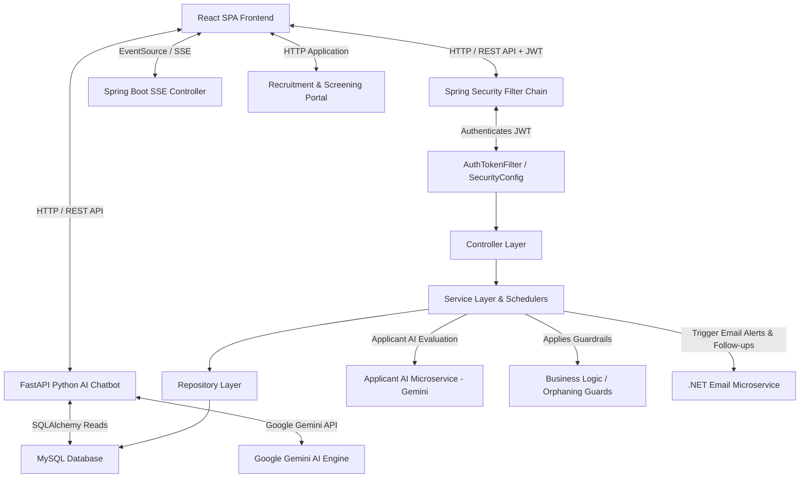
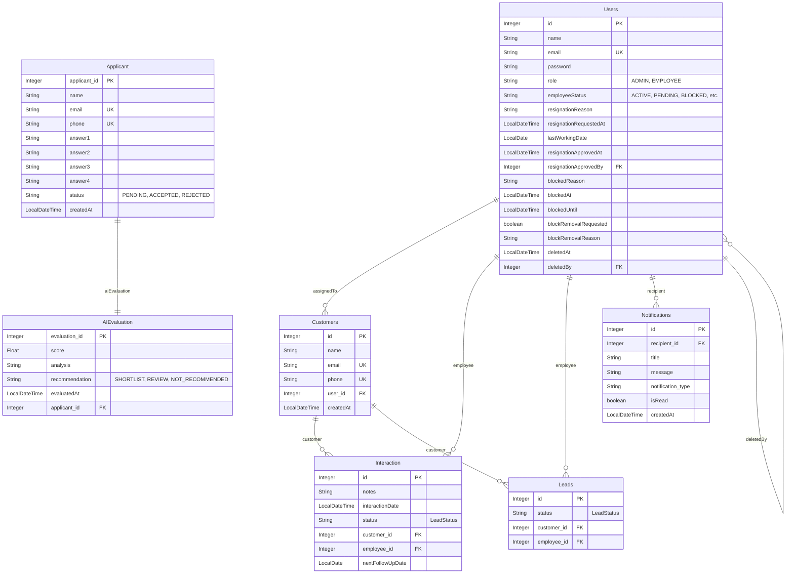

# 🏢 Enterprise Customer Relationship Management (CRM) System

[](https://www.oracle.com/java/)
[](https://spring.io/projects/spring-boot)
[](https://react.dev/)
[](https://tailwindcss.com/)
[](https://www.python.org/)
[](https://fastapi.tiangolo.com/)
[](https://ai.google.dev/)
[](https://dotnet.microsoft.com/)
[](https://www.mysql.com/)
[](https://vite.dev/)

An enterprise-grade, full-stack **Customer Relationship Management (CRM)** application designed to streamline customer onboarding, lead pipeline tracking, interactive communications history, employee lifecycle management (active, block-appeals, resignations, and soft-deletes), **AI-powered Applicant Candidate Screening & Scoring**, **AI Natural Language to SQL analytics**, **real-time SSE notifications**, **automated daily follow-up email reminders**, and a dedicated **.NET Email microservice**.

Built on a robust, multi-service architecture featuring a **Spring Boot REST API** (Java 21, Hibernate, Spring Security, JWT, SSE, Schedulers), a **React Single Page Application** (Vite, Tailwind CSS v4, Recharts), a **Python FastAPI AI Chatbot** (Google Gemini AI 1.5, LangChain, SQLAlchemy), an **Applicant AI Screening Microservice** (FastAPI, Google Gemini AI, Pydantic guardrails), and a **.NET 9 ASP.NET Core Email Microservice**.

---

## 📖 Table of Contents

1. [Project Overview](#-project-overview)
2. [Key Features](#-key-features)
3. [Technology Stack](#-technology-stack)
4. [System Architecture](#-system-architecture)
5. [Database Model & ER Diagram](#-database-model--er-diagram)
6. [API Reference Directory](#-api-reference-directory)
7. [Repository Folder Structure](#-repository-folder-structure)
8. [Installation & Local Setup](#-installation--local-setup)
9. [Business Logic & Guardrails](#-business-logic--guardrails)
10. [Documentation Reference](#-documentation-reference)

---

## 🌟 Project Overview

The Enterprise CRM supports three primary user personas with specialized, authenticated views:

- **Administrators (Admin)**: Empowered to monitor global analytics (such as top-performing employees and lead conversion rates), onboard new staff, review AI-evaluated job applicants, evaluate employee block/unblock requests, review resignation submissions, delete or restore employee profiles, run natural language database queries via AI Chatbot, and trigger real-time system notifications. All orphaned customers are automatically reassigned to Admins to maintain business continuity.
- **Employees (Employee)**: Responsible for managing their assigned customers, editing client profiles, registering interactions with scheduled follow-up dates, tracking the conversion pipeline stage (leads), interacting with the AI Chatbot for personal client insights, receiving real-time SSE notifications, updating passwords, requesting unblocks, or submitting resignation requests.
- **Applicants (Job Candidates)**: Can apply for sales positions via public screening portals, answering technical and scenario-based questions that are instantly evaluated by an AI screening microservice.

---

## 🚀 Key Features

- **Stateless JWT Security**: Secure, role-based REST endpoints backed by Spring Security with automatic expiration mechanisms and custom authentication interceptors.
- **AI Candidate Screening & Recruitment**: Integrated FastAPI microservice using Google Gemini AI (`models/gemini-flash-latest`) to evaluate applicant responses, generating numerical suitability scores, detailed qualitative analysis, and automated employee account provisioning upon admin acceptance.
- **AI-Powered Natural Language to SQL Chatbot**: Floating AI Assistant (`ChatbotWidget`) powered by Google Gemini AI and Python FastAPI. Users can query customer metrics, lead counts, and performance in plain English with role-scoped security (`ADMIN` vs `EMPLOYEE`).
- **Real-Time Push Notifications (SSE)**: Server-Sent Events (SSE) engine (`NotificationSseController` & `SseNotificationService`) delivering live status alerts, request approvals, and administrative notifications directly to the frontend without polling.
- **Automated Follow-Up Email Reminders**: Spring `@Scheduled` daily cron job that scans interaction follow-ups due today, groups them by employee, and dispatches automated digest emails via the .NET Email microservice.
- **Dedicated .NET Email Microservice**: Isolated C# / ASP.NET Core Web API microservice handling transactional email dispatches (onboarding alerts, approvals, password notifications, follow-up digests) via SMTP/MailKit.
- **Onboarding Access Workflow**: Self-service registration request screen where potential employees apply. Admins can view, approve, or reject these applications in real-time.
- **Dynamic Blocking & Appeal Pipeline**: System to temporarily block employees for audit terms. Blocked employees are locked into an "Appeal Dashboard" to request access restoration, which Admins can approve to reactivate them.
- **Resignation & Reassignment Engine**: Handles employee resignation requests gracefully. Upon approval, all customer records associated with the resigning employee are instantly reassigned to the administrator, ensuring zero customer data loss.
- **Soft Deletion & Recovery**: Soft-delete feature to disable employees without violating relational database history. Restorations automatically clean status metadata.
- **Paginated Customer Exploration**: Admin portal with server-side pagination, multi-column sorting, and fuzzy name-based search queries to handle extensive databases.
- **Conversion Analytics**: Interactive dashboards for Admins featuring graphs of conversion percentages, total active leads, and top-performing sales representatives.

---

## 🛠️ Technology Stack

### Backend Core (`/Backend/CRM`)

- **Language**: Java 21
- **Framework**: Spring Boot 4.0.5 / 3.x
- **Security**: Spring Security (JWT Stateless Authentication, custom `AuthTokenFilter`)
- **Real-Time Messaging**: Server-Sent Events (Spring `SseEmitter`)
- **Schedulers**: Spring `@Scheduled` background cron tasks for daily follow-up emails and notification cleanup
- **Database Engine**: MySQL 5.7+ / 8.x
- **ORM Layer**: Hibernate & Spring Data JPA
- **Dependency/Build Tool**: Maven (Configured in [pom.xml](file:///E:/crmProjectLatest/CustomerRelationshipManagement_CRM/Backend/CRM/pom.xml))
- **Utilities**: ModelMapper, Lombok, Validation API, JSONWebToken (`jjwt-api`)

### Frontend SPA (`/Frontend/CRM`)

- **Core Library**: React 19 (Configured in [package.json](file:///E:/crmProjectLatest/CustomerRelationshipManagement_CRM/Frontend/CRM/package.json))
- **Build Tool**: Vite 8.x
- **Styling**: Tailwind CSS v4.x (Utility-first styling with high visual aesthetics)
- **Routing**: React Router DOM v7
- **Charts**: Recharts (Customizable analytical components)
- **HTTP Client**: Axios (configured with interceptors to inject JWT headers)
- **Notifications**: React Hot Toast
- **AI Integration**: Custom Floating AI Chatbot Widget (`ChatbotWidget.jsx`)

### AI & NLP Chatbot Microservice (`/chatbot`)

- **Language**: Python 3.13+
- **Framework**: FastAPI & Uvicorn (Port 8000)
- **AI Model**: Google Gemini AI (`gemini-1.5-flash` via `langchain-google-genai`)
- **Database Connection**: SQLAlchemy & PyMySQL (Role-aware query generator and safe SQL execution)
- **Documentation**: FastAPI Interactive Swagger UI (`/docs`)

### Applicant AI Evaluation Microservice (`/Applicatant AI Analysis`)

- **Language**: Python 3.13+
- **Framework**: FastAPI & Uvicorn (Port 8001)
- **AI Model**: Google Gemini AI (`models/gemini-flash-latest`)
- **Validation**: Pydantic models for input validation and output schema enforcement

### Email Microservice (`/Net/CrmEmailService`)

- **Language & Framework**: C# / .NET 9.0 ASP.NET Core Web API (Port 5110)
- **Email Engine**: MailKit / MimeKit / `System.Net.Mail`
- **Documentation**: Swagger / OpenAPI

---

## 🗺️ System Architecture

The following diagram illustrates the multi-service architecture and data flow throughout the enterprise stack:


```mermaid
graph TD
    A[React SPA Frontend] <-->|HTTP / REST API + JWT| B[Spring Security Filter Chain]
    A <-->|EventSource / SSE| I[Spring Boot SSE Controller]
    A <-->|HTTP / REST API| J[FastAPI Python AI Chatbot]
    A <-->|HTTP Application| M[Recruitment & Screening Portal]
    J <-->|Google Gemini API| K[Google Gemini AI Engine]
    J <-->|SQLAlchemy Reads| G[MySQL Database]
    B <-->|Authenticates JWT| C[AuthTokenFilter / SecurityConfig]
    C --> D[Controller Layer]
    D --> E[Service Layer & Schedulers]
    E --> F[Repository Layer]
    F --> G[MySQL Database]
    E -->|Applicant AI Evaluation| N[Applicant AI Microservice - Gemini]
    E -->|Applies Guardrails| H[Business Logic / Orphaning Guards]
    E -->|Trigger Email Alerts & Follow-ups| L[.NET Email Microservice]
```

---

## 📊 Database Model & ER Diagram

The database structure features 7 core tables: `Users`, `Customers`, `Interaction`, `Leads`, `Notifications`, `Applicant`, and `AIEvaluation` with relational foreign keys and self-referencing joins.


```mermaid
erDiagram
    Users {
        Integer id PK
        String name
        String email UK
        String password
        String role "ADMIN, EMPLOYEE"
        String employeeStatus "ACTIVE, PENDING, BLOCKED, etc."
        String resignationReason
        LocalDateTime resignationRequestedAt
        LocalDate lastWorkingDate
        LocalDateTime resignationApprovedAt
        Integer resignationApprovedBy FK
        String blockedReason
        LocalDateTime blockedAt
        LocalDateTime blockedUntil
        boolean blockRemovalRequested
        String blockRemovalReason
        LocalDateTime deletedAt
        Integer deletedBy FK
    }
    Customers {
        Integer id PK
        String name
        String email UK
        String phone UK
        Integer user_id FK
        LocalDateTime createdAt
    }
    Interaction {
        Integer id PK
        String notes
        LocalDateTime interactionDate
        String status "LeadStatus"
        Integer customer_id FK
        Integer employee_id FK
        LocalDate nextFollowUpDate
    }
    Leads {
        Integer id PK
        String status "LeadStatus"
        Integer customer_id FK
        Integer employee_id FK
    }
    Notifications {
        Integer id PK
        Integer recipient_id FK
        String title
        String message
        String notification_type
        boolean isRead
        LocalDateTime createdAt
    }
    Applicant {
        Integer applicant_id PK
        String name
        String email UK
        String phone UK
        String answer1
        String answer2
        String answer3
        String answer4
        String status "PENDING, ACCEPTED, REJECTED"
        LocalDateTime createdAt
    }
    AIEvaluation {
        Integer evaluation_id PK
        Float score
        String analysis
        String recommendation "SHORTLIST, REVIEW, NOT_RECOMMENDED"
        LocalDateTime evaluatedAt
        Integer applicant_id FK
    }

    Users ||--o{ Customers : "assignedTo"
    Users ||--o{ Interaction : "employee"
    Users ||--o{ Leads : "employee"
    Users ||--o{ Notifications : "recipient"
    Customers ||--o{ Interaction : "customer"
    Customers ||--o{ Leads : "customer"
    Users ||--o{ Users : "resignationApprovedBy"
    Users ||--o{ Users : "deletedBy"
    Applicant ||--|| AIEvaluation : "aiEvaluation"
```

### Key Lifecycle Enums

1. **Role**: `ADMIN`, `EMPLOYEE`
2. **LeadStatus**: `NEW`, `CONTACTED`, `INTERESTED`, `NOT_INTERESTED`, `CLOSED`, `PENDING`
3. **EmployeeStatus**: `PENDING`, `ACTIVE`, `PENDING_RESIGNATION`, `RESIGNED`, `BLOCKED`, `DELETED`
4. **ApplicationStatus**: `PENDING`, `ACCEPTED`, `REJECTED`
5. **Recommendation**: `SHORTLIST`, `REVIEW`, `NOT_RECOMMENDED`
6. **NotificationType**: `CUSTOMER_REASSIGNED`, `RESIGNATION_APPROVED`, `RESIGNATION_PENDING`, `DELETED`

---

## 📋 API Reference Directory

### Authenticated Endpoints (`/auth`)

| Method | Endpoint               | Access Role   | Description                                                        |
| :----- | :--------------------- | :------------ | :----------------------------------------------------------------- |
| `POST` | `/auth/signin`         | Public        | Validates login credentials and returns JWT token & user role.     |
| `POST` | `/auth/register`       | `ADMIN`       | Allows direct creation of new employee profiles by administrators. |
| `POST` | `/auth/request-access` | Public        | Submits a registration request that starts in a `PENDING` state.   |
| `GET`  | `/auth/profile`        | Authenticated | Retrieves profile information for the currently logged-in user.    |

### Administrative Controls (`/api/admin`)

| Method   | Endpoint                                        | Description                                                            |
| :------- | :---------------------------------------------- | :--------------------------------------------------------------------- |
| `GET`    | `/api/admin/employees`                          | Lists all registered employee details.                                 |
| `GET`    | `/api/admin/employees/{id}`                     | Fetches detailed attributes of a specific employee.                    |
| `GET`    | `/api/admin/customers`                          | Paginated search list of customers (`search`, `page`, `size`, `sort`). |
| `GET`    | `/api/admin/employee/{id}/customers`            | Fetches customers currently assigned to a specific employee.           |
| `GET`    | `/api/admin/analytics/conversion-rate`          | Calculates global customer lead conversion percentages.                |
| `GET`    | `/api/admin/analytics/best-employee`            | Identifies the top-performing employee based on closed deals.          |
| `PUT`    | `/api/admin/employees/{id}/approve-resignation` | Approves resignation and triggers customer reassignment.               |
| `PUT`    | `/api/admin/employees/{id}/block`               | Blocks an employee for a set duration with reasons.                    |
| `PUT`    | `/api/admin/employees/{id}/unblock`             | Restores a blocked employee back to `ACTIVE`.                          |
| `DELETE` | `/api/admin/employees/{id}`                     | Soft-deletes an employee and reassigns their customer base.            |
| `PUT`    | `/api/admin/employees/{id}/restore`             | Restores a soft-deleted employee back to `ACTIVE`.                     |
| `GET`    | `/api/admin/access-requests`                    | Lists onboarding applications awaiting review.                         |
| `POST`   | `/api/admin/access-requests/{id}/approve`       | Approves access request, setting employee status to `ACTIVE`.          |

### Customer & Pipeline Operations (`/api/customers` & `/api/interaction`)

| Method | Endpoint                         | Access Role         | Description                                     |
| :----- | :------------------------------- | :------------------ | :---------------------------------------------- |
| `POST` | `/api/customers`                 | `ADMIN`, `EMPLOYEE` | Registers new customer profiles.                |
| `GET`  | `/api/customers/my`              | `ADMIN`, `EMPLOYEE` | Fetches customer list assigned to the caller.   |
| `GET`  | `/api/customers/{id}`            | `ADMIN`, `EMPLOYEE` | Retrieves a single customer profile.            |
| `PUT`  | `/api/customers/{id}`            | `ADMIN`, `EMPLOYEE` | Modifies client details or reassignment values. |
| `POST` | `/api/interaction`               | `ADMIN`, `EMPLOYEE` | Creates an interaction log (notes & follow-up). |
| `PUT`  | `/api/leads/{customerId}/status` | `ADMIN`, `EMPLOYEE` | Direct workflow override of lead status.        |

### Recruitment & Candidate Screening (`/api/recruitment`)

| Method | Endpoint                           | Access Role   | Description                                                         |
| :----- | :--------------------------------- | :------------ | :------------------------------------------------------------------ |
| `POST` | `/api/recruitment/register`        | Public        | Registers job applicant & screening answers for AI scoring.        |
| `GET`  | `/api/recruitment/applicants`      | `ADMIN`       | Lists all applicants sorted by AI suitability score.               |
| `GET`  | `/api/recruitment/applicants/{id}` | `ADMIN`       | Retrieves full candidate application details & answers.            |
| `PUT`  | `/api/recruitment/applicants/{id}/accept` | `ADMIN` | Approves applicant and creates an active `EMPLOYEE` account.       |
| `PUT`  | `/api/recruitment/applicants/{id}/reject` | `ADMIN` | Rejects job applicant.                                              |

### Real-Time Notifications & Microservices

| Service / Endpoint                  | Method | Access Role   | Description                                                                       |
| :---------------------------------- | :----- | :------------ | :-------------------------------------------------------------------------------- |
| `/api/notifications/stream`         | `GET`  | Authenticated | Real-time Server-Sent Events (SSE) connection stream for live alerts.             |
| `/api/chat/sql` (FastAPI Chatbot)   | `POST` | Authenticated | NLP to SQL translation and conversational analytics using Google Gemini AI.        |
| `/api/ai/evaluate` (Applicant AI)   | `POST` | Internal API  | Evaluates sales candidate responses using Gemini AI & generates score/analysis.   |
| `/api/email/send` (.NET Service)    | `POST` | Internal API  | Asynchronous email dispatching service for onboarding and follow-up alerts.      |

---

## 📁 Repository Folder Structure

```
CustomerRelationshipManagement_CRM/
├── Applicatant AI Analysis/                   # FastAPI Python Applicant AI Screening Microservice
│   ├── ai_service.py                          # Gemini AI candidate evaluation service
│   ├── app.py                                 # FastAPI application (/api/ai/evaluate)
│   ├── guardrails.py                          # Input validation & JSON schema guardrails
│   ├── models.py                              # Pydantic request/response models
│   ├── prompt.py                              # Sales competency prompt template
│   └── requirements.txt                       # Python dependencies
├── Backend/
│   └── CRM/                                   # Spring Boot Core Application
│       ├── src/main/java/com/sunbeam/crm/
│       │   ├── config/                        # Security, CORS, RestClient & Exception handling
│       │   ├── controller/                    # REST Controllers (Auth, Admin, Customer, Recruitment, SSE, etc.)
│       │   ├── dto/                           # Data Transfer Objects
│       │   ├── entity/                        # JPA Database Entities (Users, Customers, Applicant, AIEvaluation, etc.)
│       │   ├── repository/                    # Spring Data JPA repositories
│       │   ├── scheduler/                     # FollowUpReminderScheduler & NotificationCleanupScheduler
│       │   ├── security/                      # Spring Security filter chain & JWT utilities
│       │   └── service/                       # Business logic & email integration implementations
│       ├── src/main/resources/
│       │   └── application.properties         # Database credentials, JWT secret & cron schedules
│       └── pom.xml                            # Maven build descriptor
├── Frontend/
│   └── CRM/                                   # Vite-React frontend bundle
│       ├── src/
│       │   ├── api/                           # Axios instance configurations
│       │   ├── components/                    # UI modules (ChatbotWidget, Modal, ProtectedRoute, etc.)
│       │   ├── context/                       # Global authentication state
│       │   ├── layouts/                       # Dashboard structural templates
│       │   ├── pages/                         # Route pages (Dashboard, Admin, Customers, Login, etc.)
│       │   └── index.css                      # Global styles and Tailwind v4 configuration
│       ├── index.html                         # Entry HTML template
│       ├── package.json                       # Frontend dependencies config
│       └── vite.config.js                     # Vite build configuration
├── chatbot/                                   # Python FastAPI AI Chatbot (NLP to SQL)
│   ├── database.py                            # SQLAlchemy MySQL execution & safety
│   ├── nlp_sql.py                             # Google Gemini AI translation logic
│   ├── main.py                                # FastAPI app & chat endpoints
│   ├── requirements.txt                       # Python dependencies
│   └── README.md                              # AI Chatbot module setup guide
├── Net/
│   └── CrmEmailService/                       # .NET 9 ASP.NET Core Email Microservice
│       ├── Controllers/                       # Email Dispatch Controller
│       ├── Services/                          # SMTP & MailKit Service logic
│       ├── Program.cs                         # .NET API bootstrap & Swagger setup
│       └── CrmEmailService.csproj             # .NET project configuration
├── PROJECT_DOCUMENTATION.md                   # Comprehensive technical specifications
├── PROJECT_DOCUMENTATION.pdf                   # Generated PDF Documentation
└── README.md                                  # Enterprise CRM Overview & Guide
```

---

## ⚙️ Installation & Local Setup

### 📋 Prerequisites

Before launching the application services, ensure you have installed:

- **Java SDK 21** or higher.
- **Node.js** (v18.x or v20.x recommended) and **npm**.
- **Python 3.10+** (Python 3.13 recommended) & `pip`.
- **.NET 8.0 / 9.0 SDK** (for Email Microservice).
- **MySQL Server** (5.7+ / 8.x).
- **Maven** (or use the packaged wrapper `mvnw`).

---

### 1️⃣ Database Setup

Create the MySQL database scheme to match backend properties:

```sql
CREATE DATABASE crmSelf_db;
```

Configure credentials in `Backend/CRM/src/main/resources/application.properties`:

```properties
spring.datasource.url=jdbc:mysql://localhost:3306/crmSelf_db
spring.datasource.username=YOUR_MYSQL_USERNAME
spring.datasource.password=YOUR_MYSQL_PASSWORD
```

---

### 2️⃣ Run the Spring Boot Backend

From the repository root directory, navigate to the `Backend/CRM` folder and run:

```bash
cd Backend/CRM
./mvnw clean install
./mvnw spring-boot:run
```

The backend server will bootstrap on port **8080** by default.

---

### 3️⃣ Run the Python AI Chatbot Service (Port 8000)

Navigate to the `chatbot` folder, activate virtual environment, and start FastAPI:

```bash
cd chatbot
python -m venv venv
# Windows: .\venv\Scripts\Activate.ps1
# Linux/Mac: source venv/bin/activate

pip install -r requirements.txt
python main.py
```

Runs on port **8000** with Swagger UI at `http://localhost:8000/docs`.

---

### 4️⃣ Run the Applicant AI Evaluation Microservice (Port 8001)

Navigate to `Applicatant AI Analysis`, activate environment, and start FastAPI:

```bash
cd "Applicatant AI Analysis"
python -m venv venv
# Windows: .\venv\Scripts\Activate.ps1

pip install -r requirements.txt
uvicorn app:app --host 0.0.0.0 --port 8001 --reload
```

Runs on port **8001**.

---

### 5️⃣ Run the .NET Email Microservice (Port 5110)

Navigate to `Net/CrmEmailService` and run:

```bash
cd Net/CrmEmailService
dotnet run
```

Runs on port **5110** with Swagger UI.

---

### 6️⃣ Run the React Frontend

Navigate to `Frontend/CRM` and launch the Vite development server:

```bash
cd Frontend/CRM
npm install
npm run dev
```

Open browser at **http://localhost:5173**.

---

## 🔒 Business Logic & Guardrails

- **Single Assignment**: Customers must have a valid `assignedTo` user foreign key at all times.
- **Orphan Prevention**: If an employee transitions to `RESIGNED` or `DELETED`, the backend automatically transfers their customers to the active administrator account executing the state change.
- **Block Restrictions**: Admins cannot block other administrators.
- **Blocked Interceptor**: Blocked employees are routed directly to the Appeal screen upon login. All other `/api/**` requests return `403 Forbidden`.
- **AI SQL Safety Guardrails**: The Python AI Chatbot translates queries exclusively into read-only `SELECT` SQL statements with automatic role checks (`ADMIN` vs `EMPLOYEE`).
- **Applicant Screening AI Guardrails**: Candidate answers are sanitized and evaluated using structured Gemini AI models with score bounds and recommendation tags.

---

## 📚 Documentation Reference

For an in-depth review of specific endpoints, detailed entity definitions, and technical specifications, check out the developer-facing [PROJECT_DOCUMENTATION.md](file:///E:/crmProjectLatest/CustomerRelationshipManagement_CRM/PROJECT_DOCUMENTATION.md) and the generated [PROJECT_DOCUMENTATION.pdf](file:///E:/crmProjectLatest/CustomerRelationshipManagement_CRM/PROJECT_DOCUMENTATION.pdf).
